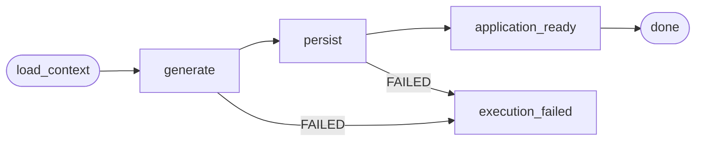

# Application Intelligence (AI Workflow)

## Purpose

Defines the AI workflow that generates the three **application artifacts** on top of
existing Career Intelligence:

- **Preparation plan** (`application_preparation`): hard/soft skill recommendations.
- **Tailored resume** (`application_resume`): resume markdown grounded in the job + profile.
- **Cover letter** (`application_cover_letter`): cover letter markdown.

The workflow is a **consumer of existing intelligence** — it never re-analyzes the job,
company or candidate. It reads the persisted outputs of the job/company/candidate
pipelines and produces only application-specific reasoning.

## Workflow

LangGraph `ApplicationIntelligenceGraph`, parametrized by intent
(`execution_type`):

- `load_context` — assembles the grounded context (see below).
- `generate` — calls `LLMService` once with the intent-specific prompt + JSON schema;
  retries once with a "shorten the response" hint when the output fails validation.
- `persist` — writes the artifact to the Applications context:
  - preparation → `application_preparations` (`payload` JSON of hard/soft skills);
    emits `ApplicationPreparationGenerated`.
  - resume/cover letter → `application_documents` (markdown `content` in a `{content}`
    envelope); emits `ApplicationDocumentGenerated`.
- `application_ready` / `execution_failed` — terminal nodes updating the processing
  workflow progress.

## Context Assembly

`build_application_context` produces a section map:

| Section | Builder | Source |
| ------- | ------- | ------ |
| `job` | `build_job_context` | `GET /api/jobs/{id}` fields |
| `job_skills` | `build_job_skills_context` | persisted `job_analysis.skills` (matched/missing/low with evidence) |
| `company` | `build_company_context` | `company_intelligence` (overview, tech, culture) |
| `candidate` | `build_candidate_context` | candidate profile + resume/LinkedIn raw text (reuses `build_candidate_profile_text`) |

The job context builders are shared with the job analysis pipeline
(`processing/application/services/job_analysis_inputs.py`) so grounding stays
consistent and there is exactly one source of truth for how intelligence is
rendered to the LLM.

## Prompts

`processing/application/services/application_intelligence_prompts.py`:

- `APPLICATION_INTELLIGENCE_PROMPT_VERSION = "1.0.0"`.
- `build_preparation_prompt` — asks for a skill plan with `build_preparation_output_schema`
  (`hard_skills`/`soft_skills` arrays; gap levels `missing|low|matching`, priorities
  `high|medium|low`).
- `build_resume_prompt` / `build_cover_letter_prompt` — ask for a document with
  `build_document_output_schema` (a `{content}` envelope holding the markdown).

## Validation

`processing/application/services/application_intelligence_validation.py`:
- `PreparationOutput` / `DocumentOutput` parse and strictly validate the LLM JSON.
- On validation failure the generate node retries once with `_RETRY_SHORTEN_HINT`,
  then surfaces `CLEAN_FAILURE_MESSAGE` ("The AI returned a result that does not
  match the required format.").

## Constraints

- All AI calls go through `LLMService` (rule 1).
- No re-analysis of job/company/user — only application-specific reasoning on top of
  existing structured intelligence.

# Related Documents

- `docs/domain/applications/application.md`
- `docs/api/applications/` — generate endpoints (202 + execution_id).
- `docs/ux/flows/applications/generate-application-artifacts.md`
