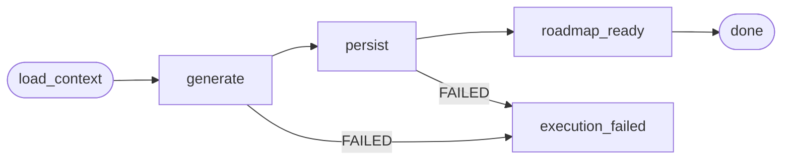

# Roadmap Generation (AI Workflow)

## Purpose

Defines the AI workflow that generates a **job-preparation roadmap** from an
Application by reusing existing Career Intelligence, and persists it into the
Roadmaps context. The roadmap replaces the legacy application **preparation plan**
(removed in prompt 146).

Like Application Intelligence, the workflow is a **consumer of existing
intelligence** — it never re-analyzes the job, company or candidate. It reads the
persisted job analysis, company intelligence and candidate profile and produces
only roadmap-specific reasoning.

## Workflow

LangGraph `RoadmapGenerationGraph`, triggered by `ExecutionType.ROADMAP_GENERATION`:



- `load_context` — assembles the grounded context (identical to Application
  Intelligence: `build_application_context`).
- `generate` — calls `LLMService` once with the roadmap prompt + JSON schema;
  retries once with a "shorten the response" hint when the output fails validation.
- `persist` — writes the roadmap through `RoadmapService.create_from_application`
  + `add_milestone`/`add_task`/`link_skill`:

  ```
  Roadmap (source=APPLICATION, application_id, goal_type=JOB, status ACTIVE)
      ├── RoadmapGoal (type=JOB, target_job_id, target_company_id)
      └── Milestones (position 0..n)
          ├── RoadmapTask (position 0..n, status NOT_STARTED)
          └── RoadmapSkillLink (skill resolved via skill_repo.resolve_skill)
  ```

  Emits `RoadmapCreated`, `RoadmapMilestoneAdded`, `RoadmapTaskAdded`,
  `RoadmapSkillLinked` through the RoadmapEventPublisher.
- `roadmap_ready` / `execution_failed` — terminal nodes updating the processing
  workflow progress.

## Context Assembly

Reuses `build_application_context` from
`processing/application/services/application_intelligence_inputs.py` — the job,
job-skills (tagged gap level), company intelligence and candidate profile sections.
See `docs/ai/application-intelligence.md` for the section table.

## Prompts

`processing/application/services/roadmap_generation_prompts.py`:

- `ROADMAP_GENERATION_PROMPT_VERSION = "1.0.0"`.
- `build_roadmap_prompt` — asks for a roadmap grounded in the persisted
  intelligence (never re-analysis), with **outcome-based milestones** (3–8),
  concrete tasks (1–8 per milestone), priorities, success criteria and skill links
  (capped ≤8 × ≤8).
- `build_roadmap_output_schema` — strict JSON schema: `title`, `goal{type: JOB,
  title, description}`, `milestones[]{title, description, priority, success_criteria,
  skills[], tasks[]{title, description, estimated_effort, success_criteria}}`;
  `milestones` is required.

## Validation

`processing/application/services/roadmap_generation_validation.py`:
- `RoadmapOutput` / `MilestonePlan` / `TaskPlan` parse and strictly validate the
  LLM JSON (priority ∈ `critical|high|medium|low`).
- On validation failure the generate node retries once, then surfaces a clean,
  user-facing failure message (mirrors Application Intelligence).

## Constraints

- All AI calls go through `LLMService` (rule 1); one structured call per generation.
- No re-analysis of job/company/user — only roadmap-specific reasoning on top of
  existing structured intelligence.
- Generation only persists into the Roadmaps context; the roadmap is an independent
  entity with logical (FK-free) references to the application and skills.

# Related Documents

- `docs/domain/roadmaps/roadmap.md` and `docs/domain/roadmaps/events.md`.
- `docs/domain/applications/application.md` — the originating application context.
- `docs/ai/application-intelligence.md` — the sibling document generation workflow.
- `docs/ux/flows/applications/generate-application-artifacts.md` — UX contract.