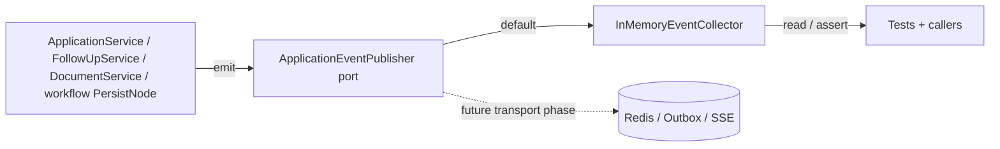

# Application Domain Events (EDD Catalog)

## Purpose

This document is the catalog for domain events emitted by the **Applications**
bounded context. It describes each event's trigger, payload, when it fires and who
may consume it.

Domain events are immutable facts (dataclasses extending
`shared.domain.domain_event.DomainEvent`) defined in
`apps/backend/applications/domain/events.py`.

## EDD Approach (Incremental)

Per AGENTS.md rule 16, event-driven design is **incremental**:

- Events are **always defined, emitted and documented** — documenting an event is
  non-negotiable even if nothing consumes it yet.
- Services emit events through the context's event publisher port
  (`applications/domain/event_publisher.py`); the default implementation is an
  **in-memory collector** — **no Redis, no SSE, no outbox**.
- Event emission is **best-effort** and never changes business behavior; tests assert
  emitted events via the collector.
- A real transport is wired to the port in a **dedicated later phase**.

### Event flow (current — in-memory)

## Event Catalog

### `application.created`

- **Event**: `ApplicationCreated`
- **Trigger**: `ApplicationService.create` persists a new application.
- **Payload**: `application_id`, `job_id`.
- **Fires when**: an application is created for a job (status defaults to `recommended`).
- **Consumers**: none yet (documented for future sync/analytics).

### `application.updated`

- **Event**: `ApplicationUpdated`
- **Trigger**: `ApplicationService.update` changes `status` or `applied_at`.
- **Payload**: `application_id`, `job_id`, `status`.
- **Fires when**: the tracker updates the application core.
- **Consumers**: none yet.

### `application.follow_up.added`

- **Event**: `ApplicationFollowUpAdded`
- **Trigger**: `FollowUpService.add`.
- **Payload**: `application_id`, `follow_up_id`, `scheduled_at`.
- **Consumers**: none yet.

### `application.follow_up.updated`

- **Event**: `ApplicationFollowUpUpdated`
- **Trigger**: `FollowUpService.update` (date, note, completion).
- **Payload**: `application_id`, `follow_up_id`, `completed`.
- **Consumers**: none yet.

### `application.follow_up.deleted`

- **Event**: `ApplicationFollowUpDeleted`
- **Trigger**: `FollowUpService.delete`.
- **Payload**: `application_id`, `follow_up_id`.
- **Consumers**: none yet.

### `application.document.generated`

- **Event**: `ApplicationDocumentGenerated`
- **Trigger**: the AI workflow persist node writes a new document version.
- **Payload**: `application_id`, `document_id`, `document_type`, `version`.
- **Consumers**: none yet.

### `application.document.updated`

- **Event**: `ApplicationDocumentUpdated`
- **Trigger**: `DocumentService.update_content` (user edit).
- **Payload**: `application_id`, `document_id`, `document_type`, `version`.
- **Consumers**: none yet.

### `application.document.deleted`

- **Event**: `ApplicationDocumentDeleted`
- **Trigger**: `DocumentService.delete`.
- **Payload**: `application_id`, `document_id`, `document_type`.
- **Consumers**: none yet.

## Emission Rules

- Events are emitted by the service/workflow node that performs the state change —
  never by callers (rule 16b).
- Emission is best-effort: a collector failure must not fail the business operation
  (rule 16c).
- Tests assert emitted events through the collector (rule 16d).

# Related Documents

- `docs/domain/applications/application.md`
- `docs/ai/application-intelligence.md`
