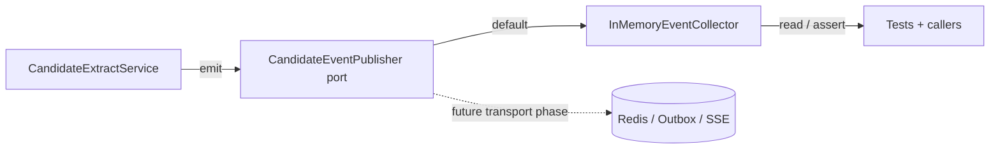

# Candidate Domain Events (EDD Catalog)

## Purpose

This document is the catalog for domain events emitted by the **Candidates**
bounded context. It describes each event's trigger, payload, when it fires and
who may consume it.

Domain events are immutable facts (dataclasses extending
`shared.domain.domain_event.DomainEvent`) defined in
`apps/backend/candidates/domain/events.py`. They represent things that happened
in the candidate profile domain — never commands.

## EDD Approach (Incremental)

Per AGENTS.md rule 16, event-driven design is **incremental** in this repo:

- Events are **always defined, emitted and documented** — documenting an event
  is non-negotiable even if nothing consumes it yet.
- Services **collect and emit** events through the context's event publisher
  port (`candidates/domain/event_publisher.py`).
- The **default implementation is an in-memory collector**
  (`InMemoryEventCollector`) — **no Redis, no SSE, no outbox**. Events are
  observable now (tests assert them, callers can read them) but no transport
  exists yet.
- A real transport (Redis pub/sub, outbox, SSE) is wired to the port in a
  **dedicated later phase** without touching the domain or application layers.

### Event flow (current — in-memory)



### Event flow (target — future transport)

```
Service state change
        ↓
Domain event
        ↓
Event publisher (Redis / outbox)
        ↓
Consumers (SSE, analytics, notifications, other contexts)
```

## Ownership

- **Domain layer** owns the event definitions (`candidates/domain/events.py`).
- **Application layer** (the service performing the state change) emits them —
  never callers. Events are emitted by the service that performs the state
  change (AGENTS.md rule 16b).
- **Infrastructure layer** will consume events for transport in a later phase.
- Emission is **best-effort** and must never change business behavior
  (AGENTS.md rule 16c).

## Event Categories

All candidate events are prefixed `candidate.`. They fall into two groups:

1. Profile lifecycle: `candidate.profile.created`, `candidate.profile.updated`,
   `candidate.version.created`.
2. Source / merge lifecycle: `candidate.source.added`, `candidate.source.updated`,
   `candidate.source.skipped`, `candidate.merge.completed`, `candidate.skill.inferred`.

## Event Catalog

Every event carries the base `DomainEvent` fields (`event_id`, `occurred_at`,
`aggregate_id` = the profile id) plus its own payload.

---

### candidate.profile.created

| Aspect   | Value                                                        |
| -------- | ------------------------------------------------------------ |
| Trigger  | A fresh candidate profile (singleton) is created the first time the extraction service loads it (`get_or_create_current` on an empty DB). |
| Payload  | `profile_id`                                                 |
| When     | First `extract()` / `merge_and_persist()` on a new installation. |
| Consumers| (none yet) — analytics, onboarding, notifications.           |

---

### candidate.profile.updated

| Aspect   | Value                                                        |
| -------- | ------------------------------------------------------------ |
| Trigger  | A merge changed the profile (core fields or any child section) vs. the pre-merge snapshot. |
| Payload  | `profile_id`                                                 |
| When     | Any `merge_and_persist()` whose `ProfileDiff` is non-empty.  |
| Consumers| (none yet) — caching, search indexing, change notifications. |

---

### candidate.source.added

| Aspect   | Value                                                        |
| -------- | ------------------------------------------------------------ |
| Trigger  | A new source row (source type + version) is recorded.        |
| Payload  | `profile_id`, `source_type`, `version`                       |
| When     | First time a source version is seen (`_record_source` create path). |
| Consumers| (none yet) — audit trail, per-source state machines.         |

---

### candidate.source.updated

| Aspect   | Value                                                        |
| -------- | ------------------------------------------------------------ |
| Trigger  | An existing source row changes state (processed / failed).   |
| Payload  | `profile_id`, `source_type`, `version`, `status`             |
| When     | A source is marked `processed` after a merge, or `failed` after an empty/extraction-failure. |
| Consumers| (none yet) — audit trail, dashboard badges.                  |

---

### candidate.source.skipped

| Aspect   | Value                                                        |
| -------- | ------------------------------------------------------------ |
| Trigger  | A source version was not processed: already processed, empty text, or no content. |
| Payload  | `profile_id`, `source_type`, `version`, `reason` (`already_processed` / `empty_text`). |
| When     | During `extract()` skip paths.                               |
| Consumers| (none yet) — metrics, debugging pipeline runs.               |

---

### candidate.merge.completed

| Aspect   | Value                                                        |
| -------- | ------------------------------------------------------------ |
| Trigger  | An extracted source payload was folded into the canonical profile. |
| Payload  | `profile_id`, `source_type`, `version`                       |
| When     | Once per source included in a `merge_and_persist()` run.     |
| Consumers| (none yet) — derived projections, downstream analytics.      |

---

### candidate.version.created

| Aspect   | Value                                                        |
| -------- | ------------------------------------------------------------ |
| Trigger  | A new immutable `CandidateProfileVersion` snapshot was persisted. |
| Payload  | `profile_id`, `version`                                      |
| When     | Every `merge_and_persist()` (v1 for the first merge, then +1). |
| Consumers| (none yet) — timeline UI, diff/audit tooling.                |

---

### candidate.skill.inferred

| Aspect   | Value                                                        |
| -------- | ------------------------------------------------------------ |
| Trigger  | A skill was added to the profile by a merge (a skill the profile did not know before). |
| Payload  | `profile_id`, `skill_id`, `skill_name`, `confidence`         |
| When     | For each skill in the diff's `added` set during `merge_and_persist()`. |
| Consumers| (none yet) — skill-vocabulary enrichment, market analysis.    |

## Emission Points

The service emits events at exactly two places (never by callers):

- `CandidateExtractService.extract()` — `candidate.profile.created` (on first
  profile creation), `candidate.source.skipped`, source failed/skip bookkeeping
  events.
- `CandidateExtractService.merge_and_persist()` — `candidate.source.added` /
  `candidate.source.updated` (recording processed sources), then
  `candidate.profile.updated`, `candidate.merge.completed`,
  `candidate.version.created`, `candidate.skill.inferred`.

The merge summary returned by `merge_and_persist()` lists the emitted event
types (`events`), and the collector exposes full event objects via
`service.event_publisher.events` / `take_events()`.

## Testing

Tests assert emitted events through the collector (AGENTS.md rule 16d):

- `apps/backend/tests/candidates/domain/test_candidate_events.py` — event
  dataclasses + `InMemoryEventCollector` behaviour.
- `apps/backend/tests/candidates/application/test_candidate_merge_and_events.py`
  — event emission across extract/merge/skip paths.
- `apps/backend/tests/candidates/application/test_candidate_extract_service_integration.py`
  — real-DB round-trip event assertions.
- `apps/backend/tests/processing/application/test_candidate_processing.py` —
  events emitted through the full LangGraph workflow.

## Future Work (Deferred)

- Wire `CandidateEventPublisher` to a real transport (Redis pub/sub, outbox).
- SSE / notification consumers.
- Cross-context consumers (e.g. skills context reacting to
  `candidate.skill.inferred`).

## Related Documents

- `docs/domain/processing/events.md` — processing lifecycle events
- `apps/backend/candidates/domain/events.py` — event definitions
- `apps/backend/candidates/domain/event_publisher.py` — port + collector
