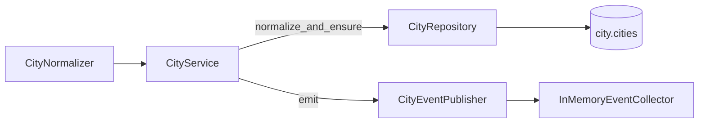

# Cities Domain

## Purpose

The **Cities** bounded context owns the canonical, normalized city catalog.

During processing, jobs, companies and candidate profiles report a free-text
location. The `CityNormalizer` extracts a unique canonical `{city, country}`
from that text and ensures a row exists in the `city.cities` table. The
originating record then stores the normalized `city` + `country` and a logical
`city_id` pointing at that row.

## Design Rules

- The Cities context owns the `city` schema and the `cities` table.
- `city_id` on jobs / companies / candidate profiles is a **logical reference
  only** (a plain UUID column) — no cross-context `ForeignKey` constraint
  (AGENTS.md rule 15). Referential integrity is enforced at the repository /
  service layer.
- The catalog is **derived from processing**, not edited directly. It is
  exposed read-only via `GET /api/cities/list`.
- Normalization always produces a **unique** `{city, country}` — enforced by a
  `UniqueConstraint(city, country)` on the table.

## Entity

`City` (aggregate root, `apps/backend/cities/domain/entities/city.py`):

| Field          | Type   | Notes                                   |
| -------------- | ------ | --------------------------------------- |
| id             | str    | UUID7                                   |
| city           | str    | Canonical city name                     |
| country        | str    | Canonical country name                  |
| original_text  | str?   | First-seen source location string       |
| address        | str?   | First-seen address / HQ string          |

## Normalization

`CityNormalizer.normalize(text) -> (city, country)` produces the canonical
form. It handles:

- **Aliases** — e.g. `München` → `Munich`, `Köln` → `Cologne`, `Zürich` →
  `Zurich`, `Wien` → `Vienna`, `Nürnberg` → `Nuremberg`, `Düsseldorf` →
  `Duesseldorf`, `Frankfurt am Main` → `Frankfurt`.
- **City → country map** — e.g. `Berlin` → `Germany`, `Amsterdam` →
  `Netherlands`, `Utrecht` → `Netherlands`.
- **Comma split** — the last comma-separated token is treated as the country
  (e.g. `Berlin, Germany` → city `Berlin`, country `Germany`).
- **Slash / pipe split** — takes the first token as the city and resolves the
  country from the city map (e.g. `Berlin / Munich`).
- **Remote** — `Remote` → `("Remote", "")`; `Remote Germany` →
  `("Remote", "Germany")`.
- **Fallback** — unknown input is title-cased with an empty country.

## Persistence

`SQLAlchemyCityRepository` (`cities/infrastructure/repositories/sa_city_repository.py`)
implements `ICityRepository`:

- `find_by_city_country(city, country) -> dict | None`
- `create({city, country, original_text, address}) -> dict`
- `list(query, sort, order, page_size, cursor) -> Page[CityListItem]` — feeds
  `GET /api/cities/list`, aggregating `job_count` via a `LEFT JOIN` against the
  jobs table (no N+1).

## Service

`CityService` (`cities/application/services/city_service.py`) is the
application facade. It exposes:

- `normalize_and_ensure(raw, address="") -> dict | None` — normalizes the raw
  text and ensures the canonical row exists, emitting `CityCreated` as
  appropriate.
- `list(...) -> Page[CityListItem]` — delegates to the repository.

Jobs, companies and candidate profiles receive an injected `CityService`
during processing and call `normalize_and_ensure(location)` to persist their
normalized location and `city_id`.

## Repository

## Migration

Initial schema: `apps/alembic/city/versions/city_001_initial_cities_schema.py`.

## Related Documents

- docs/domain/cities/events.md
- docs/api/cities/list-cities.md
- docs/ux/features/cities/page.md