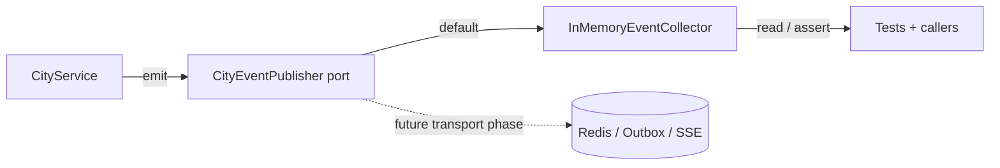

# Cities Domain Events (EDD Catalog)

## Purpose

This document is the catalog for domain events emitted by the **Cities**
bounded context. It describes each event's trigger, payload, when it fires and
who may consume it.

Domain events are immutable facts (dataclasses extending
`shared.domain.domain_event.DomainEvent`) defined in
`apps/backend/cities/domain/events.py`. They represent things that happened in
the city catalog domain — never commands.

## EDD Approach (Incremental)

Per AGENTS.md rule 16, event-driven design is **incremental** in this repo:

- Events are **always defined, emitted and documented** — documenting an event
  is non-negotiable even if nothing consumes it yet.
- Services **collect and emit** events through the context's event publisher
  port (`cities/domain/event_publisher.py`).
- The **default implementation is an in-memory collector**
  (`InMemoryEventCollector`) — **no Redis, no SSE, no outbox**. Events are
  observable now (tests assert them, callers can read them) but no transport
  exists yet.
- A real transport (Redis pub/sub, outbox, SSE) is wired to the port in a
  **dedicated later phase** without touching the domain or application layers.

### Event flow (current — in-memory)



### Event flow (target — future transport)

```
Service state change
        ↓
Domain event
        ↓
Event publisher (Redis / outbox)
        ↓
Consumers (SSE, analytics, notifications, other contexts)
```

## Ownership

- **Domain layer** owns the event definitions (`cities/domain/events.py`).
- **Application layer** (the service performing the state change) emits them —
  never callers (AGENTS.md rule 16b).
- **Infrastructure layer** will consume events for transport in a later phase.
- Emission is **best-effort** and must never change business behavior
  (AGENTS.md rule 16c).

## Event Categories

All cities events are prefixed `city.`:

1. Catalog lifecycle: `city.created`.
2. Linking: `city.linked`.

## Event Catalog

Every event carries the base `DomainEvent` fields (`event_id`, `occurred_at`,
`aggregate_id`) plus its own payload.

---

### city.created

| Aspect   | Value                                                                 |
| -------- | --------------------------------------------------------------------- |
| Trigger  | A brand-new canonical `{city, country}` row was created in the catalog. |
| Payload  | `city_id`, `city`, `country`                                          |
| Fires    | In `CityService.ensure` when no existing row matched `{city, country}`. |
| Consumers| None yet (future: analytics, geocoding enrichment).                   |

---

### city.linked

| Aspect   | Value                                                                 |
| -------- | --------------------------------------------------------------------- |
| Trigger  | (Defined, not yet emitted) An entity (job / company / profile) is linked to an existing city row. |
| Payload  | `city_id`, `target_type` (job | company | profile), `target_id`       |
| Fires    | Reserved for a later phase: `CityService.ensure` currently only emits `city.created`. Emitting `city.linked` requires the calling context to pass its target type/id into the service; that wiring lands with the transport phase. |
| Consumers| None yet.                                                             |

---

## Related Documents

- docs/domain/cities/cities.md
- docs/api/cities/list-cities.md
- docs/ux/features/cities/page.md