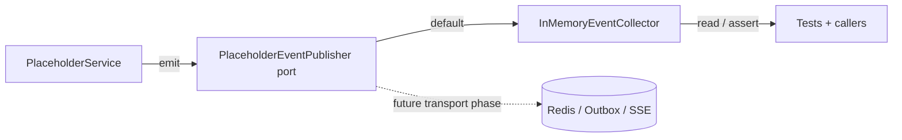

# Placeholders Domain Events (EDD Catalog)

## Purpose

This document is the catalog for domain events emitted by the **Placeholders**
bounded context. It describes each event's trigger, payload, when it fires and who
may consume it.

Domain events are immutable facts (dataclasses extending
`shared.domain.domain_event.DomainEvent`) defined in
`apps/backend/placeholders/domain/events.py`.

## EDD Approach (Incremental)

Per AGENTS.md rule 16, event-driven design is **incremental**:

- Events are **always defined, emitted and documented** — documenting an event is
  non-negotiable even if nothing consumes it yet.
- Services emit events through the context's event publisher port
  (`placeholders/domain/event_publisher.py`); the default implementation is an
  **in-memory collector** — **no Redis, no SSE, no outbox**.
- Event emission is **best-effort** and never changes business behavior; tests
  assert emitted events via the collector.
- A real transport is wired to the port in a **dedicated later phase**.

### Event flow (current — in-memory)

## Event Catalog

### `placeholders.updated`

- **Event**: `PlaceholdersUpdated`
- **Trigger**: `PlaceholderService.upsert_many` persists one or more placeholder
  values.
- **Payload**: `keys` (tuple of the changed placeholder keys).
- **Fires when**: the user saves the Placeholders page, or any bulk upsert.
- **Consumers**: none yet (a future consumer could refresh cached documents or
  notify generation pipelines).

## Emission Rules

- Events are emitted by the service that performs the state change — never by
  callers (rule 16b).
- Emission is best-effort: a collector failure must not fail the business operation
  (rule 16c).
- Tests assert emitted events through the collector (rule 16d).

# Related Documents

- `docs/domain/placeholders/placeholders.md` — entity model and business rules.
- `implementation-history/175_feature_placeholders_pdf.md` — this implementation.