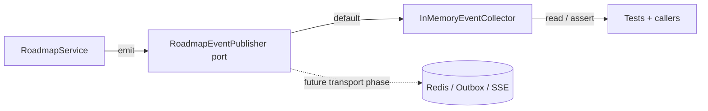

# Roadmap Domain Events (EDD Catalog)

## Purpose

This document is the catalog for domain events emitted by the **Roadmaps** bounded
context. It describes each event's trigger, payload, when it fires and who may
consume it.

Domain events are immutable facts (dataclasses extending
`shared.domain.domain_event.DomainEvent`) defined in
`apps/backend/roadmaps/domain/events.py`.

## EDD Approach (Incremental)

Per AGENTS.md rule 16, event-driven design is **incremental**:

- Events are **always defined, emitted and documented** — documenting an event is
  non-negotiable even if nothing consumes it yet.
- Services emit events through the context's event publisher port
  (`roadmaps/domain/event_publisher.py`); the default implementation is an
  **in-memory collector** — **no Redis, no SSE, no outbox**.
- Event emission is **best-effort** and never changes business behavior; tests
  assert emitted events via the collector.
- A real transport is wired to the port in a **dedicated later phase**.

### Event flow (current — in-memory)

## Event Catalog

### `roadmap.created`

- **Event**: `RoadmapCreated`
- **Trigger**: `RoadmapService.create_manual` / `create_from_application` persist a
  new roadmap.
- **Payload**: `roadmap_id`, `source`, `application_id?`.
- **Fires when**: a manual or application-driven roadmap is created.
- **Consumers**: none yet.

### `roadmap.updated`

- **Event**: `RoadmapUpdated`
- **Trigger**: `RoadmapService.update` changes title/description/status/goal.
- **Payload**: `roadmap_id`, `status`.
- **Consumers**: none yet.

### `roadmap.deleted`

- **Event**: `RoadmapDeleted`
- **Trigger**: `RoadmapService.delete`.
- **Payload**: `roadmap_id`.
- **Consumers**: none yet.

### `roadmap.milestone.added`

- **Event**: `RoadmapMilestoneAdded`
- **Trigger**: `RoadmapService.add_milestone`.
- **Payload**: `roadmap_id`, `milestone_id`.
- **Consumers**: none yet.

### `roadmap.milestone.updated`

- **Event**: `RoadmapMilestoneUpdated`
- **Trigger**: `RoadmapService.update_milestone` (title, description, status,
  priority, position).
- **Payload**: `roadmap_id`, `milestone_id`, `status`.
- **Consumers**: none yet.

### `roadmap.milestone.deleted`

- **Event**: `RoadmapMilestoneDeleted`
- **Trigger**: `RoadmapService.delete_milestone`.
- **Payload**: `roadmap_id`, `milestone_id`.
- **Consumers**: none yet.

### `roadmap.task.added`

- **Event**: `RoadmapTaskAdded`
- **Trigger**: `RoadmapService.add_task`.
- **Payload**: `roadmap_id`, `milestone_id`, `task_id`.
- **Consumers**: none yet.

### `roadmap.task.updated`

- **Event**: `RoadmapTaskUpdated`
- **Trigger**: `RoadmapService.update_task` — also fired on status change (which
  recomputes progress).
- **Payload**: `roadmap_id`, `milestone_id`, `task_id`, `status`.
- **Consumers**: none yet.

### `roadmap.task.deleted`

- **Event**: `RoadmapTaskDeleted`
- **Trigger**: `RoadmapService.delete_task`.
- **Payload**: `roadmap_id`, `milestone_id`, `task_id`.
- **Consumers**: none yet.

### `roadmap.note.added`

- **Event**: `RoadmapNoteAdded`
- **Trigger**: `RoadmapService.add_note`.
- **Payload**: `roadmap_id`, `note_id`.
- **Consumers**: none yet.

### `roadmap.resource.added`

- **Event**: `RoadmapResourceAdded`
- **Trigger**: `RoadmapService.add_resource`.
- **Payload**: `roadmap_id`, `resource_id`.
- **Consumers**: none yet.

### `roadmap.skill.linked`

- **Event**: `RoadmapSkillLinked`
- **Trigger**: `RoadmapService.link_skill` resolves and links a global skill to a
  milestone or task.
- **Payload**: `roadmap_id`, `link_id`, `skill_id`.
- **Consumers**: none yet.

## Emission Rules

- Events are emitted by the service that performs the state change — never by
  callers (rule 16b).
- Emission is best-effort: a collector failure must not fail the business operation
  (rule 16c).
- Tests assert emitted events through the collector (rule 16d).

# Related Documents

- `docs/domain/roadmaps/roadmap.md` — entity model and business rules.
- `implementation-history/144_proposal_roadmap.md` — the spec.