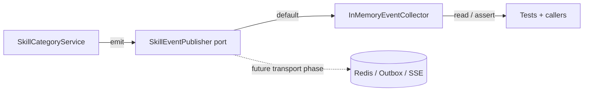

# Skills Domain Events (EDD Catalog)

## Purpose

This document is the catalog for domain events emitted by the **Skills**
bounded context. It describes each event's trigger, payload, when it fires and
who may consume it.

Domain events are immutable facts (dataclasses extending
`shared.domain.domain_event.DomainEvent`) defined in
`apps/backend/skills/domain/events.py`. They represent things that happened in
the skill taxonomy domain — never commands.

## EDD Approach (Incremental)

Per AGENTS.md rule 16, event-driven design is **incremental** in this repo:

- Events are **always defined, emitted and documented** — documenting an event
  is non-negotiable even if nothing consumes it yet.
- Services **collect and emit** events through the context's event publisher
  port (`skills/domain/event_publisher.py`).
- The **default implementation is an in-memory collector**
  (`InMemoryEventCollector`) — **no Redis, no SSE, no outbox**. Events are
  observable now (tests assert them, callers can read them) but no transport
  exists yet.
- A real transport (Redis pub/sub, outbox, SSE) is wired to the port in a
  **dedicated later phase** without touching the domain or application layers.

### Event flow (current — in-memory)



### Event flow (target — future transport)

```
Service state change
        ↓
Domain event
        ↓
Event publisher (Redis / outbox)
        ↓
Consumers (SSE, analytics, notifications, other contexts)
```

## Ownership

- **Domain layer** owns the event definitions (`skills/domain/events.py`).
- **Application layer** (the service performing the state change) emits them —
  never callers. Events are emitted by the service that performs the state
  change (AGENTS.md rule 16b).
- **Infrastructure layer** will consume events for transport in a later phase.
- Emission is **best-effort** and must never change business behavior
  (AGENTS.md rule 16c).

## Event Categories

All skills events are prefixed `skill.`. They fall into two groups:

1. Category lifecycle: `skill.category.created`, `skill.category.deleted`,
   `skill.categories.changed`.
2. Normalization: `skill.breakdown.created`, `skill.canonical.changed`.

## Event Catalog

Every event carries the base `DomainEvent` fields (`event_id`, `occurred_at`,
`aggregate_id`) plus its own payload.

---

### skill.category.created

| Aspect   | Value                                                        |
| -------- | ------------------------------------------------------------ |
| Trigger  | A brand-new category name was added to the catalog (`create_category` when the name did not already exist). |
| Payload  | `aggregate_id` (category id), `name`                          |
| When     | First time a category name is created via `POST /api/skills/categories`. |
| Consumers| (none yet) — filter facet hydration, analytics.               |

---

### skill.category.deleted

| Aspect   | Value                                                        |
| -------- | ------------------------------------------------------------ |
| Trigger  | An unused category was removed from the catalog (`delete_category` success path). |
| Payload  | `name`                                                       |
| When     | `DELETE /api/skills/categories/{name}` against a category with no linked skills. |
| Consumers| (none yet) — filter facet refresh, audit trail.               |

---

### skill.categories.changed

| Aspect   | Value                                                        |
| -------- | ------------------------------------------------------------ |
| Trigger  | A skill's category set changed: created/updated/categorized/bulk-categorized. |
| Payload  | `aggregate_id`, `skill_id`, `skill_name`, `categories`       |
| When     | `set_skill_categories`, `categorize`, `bulk_categorize`, or `update_skill` result in a category-set diff vs. the pre-change snapshot. Not emitted when the set is unchanged. |
| Consumers| (none yet) — search indexing, cached skill rows, downstream analytics. |

---

### skill.breakdown.created

| Aspect   | Value                                                        |
| -------- | ------------------------------------------------------------ |
| Trigger  | A composite skill was broken into atomic children via `POST /api/skills/{id}/breakdown`. |
| Payload  | `aggregate_id`, `skill_id` (origin), `skill_name`, `children` (tuple of child names) |
| When     | `SkillNormalizationService.break_down` succeeds (origin soft-hidden, mentions duplicated, `skill_breakdowns` rows recorded). |
| Consumers| (none yet) — extraction map invalidation, search re-indexing. |

---

### skill.canonical.changed

| Aspect   | Value                                                        |
| -------- | ------------------------------------------------------------ |
| Trigger  | An alias was promoted to be a skill's canonical name via `PATCH /api/skills/{id}/canonical`. |
| Payload  | `aggregate_id`, `skill_id`, `previous_name`, `new_name`      |
| When     | `SkillNormalizationService.promote_alias_to_canonical` succeeds (old canonical name becomes an alias). |
| Consumers| (none yet) — search indexing, downstream analytics.          |
