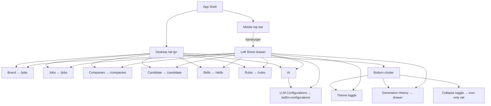

# App Shell — Sidebar Navigation

## Purpose

The app shell provides the top-level navigation via a **left sidebar** rail.
On desktop (`lg+`) a fixed rail holds the brand, the primary nav items, and a
bottom action cluster (theme toggle, Generation History, collapse toggle). On
mobile (`<lg`) the rail is hidden; a slim top bar with a hamburger opens the
same content as a left `Sheet` drawer.

---

# Anatomy

## Desktop rail (lg+)

```text
┌──────────────┬──────────────────────────────────────────────────────────────┐
│ ◪ Job Search │                                                              │
│              │                         page content                         │
│ ◉ Jobs       │                  (flex column beside the rail)               │
│ ▣ Companies  │                                                              │
│ ▤ Candidate  │                                                              │
│ ▧ Skills     │                                                              │
│ ⚙ Rules      │                                                              │
│ 🧠 AI ▾      │                                                              │
│   └ LLM Conf │                                                              │
│              │                                                              │
│ ─────────────│                                                              │
│ [🌙] [☰]    │                                                              │
│ [◱] Collapse │                                                              │
└──────────────┴──────────────────────────────────────────────────────────────┘

Collapsed rail (w-[68px], icon-only, tooltips):
┌──────┬───────────────────────────────────────────────────────────────┐
│ ◪    │                                                               │
│ ◉    │                                                               │
│ ▣    │                                                               │
│ ▤    │                                                               │
│ ▧    │                                                               │
│ ⚙    │                                                               │
│ 🧠   │                                                               │
│      │                                                               │
│ ─────│                                                               │
│ 🌙   │                                                               │
│ ☰    │                                                               │
│ ◱    │                                                               │
└──────┴───────────────────────────────────────────────────────────────┘

AI submenu (expanded rail):
┌──────────────┐
│ 🧠 AI ▾      │
│   └ LLM Configurations │
└──────────────┘
```

## Mobile drawer (<lg)

```text
┌──────────────────────────┬─────────────────────────────────────────┐
│ ☰ Job Search    [🌙] [☰] │                                         │
│ ─────────────────────────│              page content              │
│ ◪ ◉ ▣ ▤ ▧ ⚙ 🧠          │                                         │
│   └ LLM Configurations   │                                         │
└──────────────────────────┴─────────────────────────────────────────┘

Hamburger (☰) opens left Sheet (w-72):
┌────────────────┐
│ ◪ Job Search   │
├────────────────┤
│ ◉ Jobs         │
│ ▣ Companies    │
│ ▤ Candidate    │
│ ▧ Skills       │
│ ⚙ Rules        │
│ 🧠 AI ▾        │
│   └ LLM Configurations │
│                │
├────────────────┤
│ [🌙] [☰]      │
└────────────────┘
```

## Navigation tree



---

# Elements

| Element                  | Behavior                                                       |
| ------------------------ | -------------------------------------------------------------- |
| Brand (rail / drawer)    | Navigates to `/jobs`; monochrome `bg-primary` mark + `text-primary` wordmark. |
| Top-level items          | Navigate to `/{id}` (`jobs`, `companies`, `candidate`, `skills`, `rules`). |
| `AI ▾` (expanded rail)   | Inline expandable group; chevron rotates; children indented under a left border. |
| `AI` (collapsed rail)    | Expands the sidebar and opens the AI group.                    |
| Active item              | `bg-primary/10` + `text-primary` + left accent bar (desktop, expanded only). |
| Nav icons                | **Monochrome** — icons inherit the row's text color (`text-primary` active, `text-muted-foreground` idle); no per-item colors. |
| Theme toggle             | Switches light/dark.                                           |
| History button           | Opens the Generation History drawer.                           |
| Collapse toggle          | Narrowed to `w-[68px]` icon-only rail; labels become tooltips; state persisted in `localStorage`. |

---

# States

## Active item

The item matching the current route (`/pathname[1]`) is highlighted with a
primary background tint + primary text and a left accent bar (desktop rail,
expanded). Its sub-item (e.g. LLM Configurations on `/ai/llm-configurations`)
is marked primary in the inline group.

## Clicking the active item

Pushes the same route again — a no-op navigation. The menu **stays visible** —
no collapse, no reload.

## Collapsed rail

Clicking an icon navigates immediately (tooltip shows the label). Clicking a
parent with children (AI) expands the sidebar first, then opens the group. The
collapse state persists across reloads.

## Mobile

The rail is hidden below `lg`; a hamburger in the slim top bar opens a left
sheet with the same items and the `AI` submenu expanded inline. Selecting any
item navigates and closes the sheet.

---

# Behavior Rules

- `go(id, childId?)` → `router.push(childId ? /{id}/{childId} : /{id})`; on
  mobile it also closes the sheet.
- The desktop rail is `hidden lg:flex`; the top bar is `lg:hidden`.
- Rail widths: `w-60` expanded, `w-[68px]` collapsed (transition-all 150ms).
- The rail and sheet share the same `NAV_ITEMS` data and `NavRow` rendering.
- Page content sits in a `flex` column beside the rail; there is **no** fixed
  header offset (`pt-16` is gone). Page widgets fill `h-full`.
- `GenerationHistoryDrawer` is dynamically imported (`ssr: false`).

---

# Theming

The app theme is driven **entirely from `app/globals.css`** — one file, no
component-level color literals. The sidebar uses only theme tokens
(`bg-card`, `text-primary`, `text-muted-foreground`, `bg-primary`,
`text-primary-foreground`, `border-border`), so re-theming the whole app
(including the sidebar) is a single-file change:

- **Light theme** = the `:root { … }` block in `app/globals.css`, e.g.
  `--primary: oklch(0.214 0.009 43.1)` (warm taupe, from the
  `b4ZVZIPi9h` preset).
- **Dark theme** = the `.dark { … }` block in the same file.
- `@theme inline` maps those CSS variables to Tailwind utilities
  (`--color-primary: var(--primary)`, …), so `text-primary`, `bg-card`, etc.
  resolve to the tokens above.
- The tokens live in the **unlayered** `:root` / `.dark` blocks (which also
  carry the project's semantic extras `--bg`, `--surface`, `--green`, …). The
  preset's `@layer base` duplicate token block is removed — it is overridden by
  the unlayered blocks in the cascade.
- Example: to switch the accent color, change `--primary` (and its
  `-foreground`) in both `:root` and `.dark` — no component edits needed.
- To apply the saved theme preset:
  `./start theme [code]` (runs `npx shadcn@latest apply <code> -y` in
  `apps/frontend`; defaults to `b4ZVZIPi9h`), or the equivalent one-liner
  `cd apps/frontend && npx shadcn@latest apply --preset b4ZVZIPi9h`
  (radix-lyra style, taupe base, remixicon icons, JetBrains Mono base font +
  Merriweather heading font).
- **Fonts** — the preset defines two font tokens, both honored app-wide:
  `--font-mono`/`--font-sans` → JetBrains Mono (the base font; `html` is
  `@apply font-mono` and the body inherits it, and `--font-sans` maps to the
  same token so `font-sans` can never fall back to the system stack) and
  `--font-heading` → Merriweather (used by `font-heading` component titles).
  Both load from the Google Fonts CDN via `<link>` tags rendered in
  `app/layout.tsx` (`<body>`; React hoists them into `<head>`). The
  `next/font/google` setup in the same file stays in place as the shadcn-managed
  build-time source. The CDN `<link>` tags are preserved by `./start theme`
  (the apply pipeline only rewrites the `next/font` imports and the `<html>`
  className, never body-level `<link>` elements), so the fonts keep working
  after any theme re-apply — and re-applying this preset regenerates the exact
  same `--font-mono`/`--font-heading` tokens.

---

# Related Documents

- `docs/ux/features/jobs/page.md` (page content under the shell)
- `docs/ux/features/companies/page.md`
- `docs/ux/features/skills/page.md`
- `DESIGN.md` (navigation structure wireframe)
