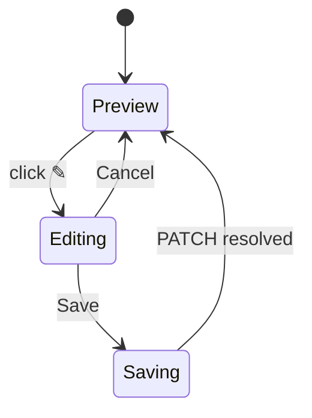

# Application Documents

## Purpose

The Documents section manages the two versioned application documents: the **tailored
resume** and the **cover letter**. Each is generated by the AI workflow
(`application_resume` / `application_cover_letter` executions) and stored as markdown
content with a version number.

## High-Level Layout

```text
DOCUMENTS
┌────────────────────────────────────────┐  ┌────────────────────────────────────────┐
│ [📄] Tailored Resume        v2   [🗑]  │  │ [📄] Cover Letter           v1   [🗑]  │
│      [copy] [↓] [✎]  [⚡ Regenerate]    │  │      [copy] [↓] [✎]  [⚡ Regenerate]    │
│ ┌────────────────────────────────────┐ │  │ ┌────────────────────────────────────┐ │
│ │ # Staff Engineer Resume            │ │  │ │ Dear Hiring Team,                 │ │
│ │ ... markdown preview (max-h, scroll)│ │  │ │ ...                              │ │
│ └────────────────────────────────────┘ │  │ └────────────────────────────────────┘ │
│ Updated Aug 11, 2026                    │  │ Updated Aug 11, 2026                    │
└────────────────────────────────────────┘  └────────────────────────────────────────┘
```

## Component Hierarchy

```text
ApplicationDocuments
├── DocumentCard (tailored_resume)   resume = documents.find(type === 'tailored_resume')
└── DocumentCard (cover_letter)      coverLetter = documents.find(type === 'cover_letter')
```

Each `DocumentCard`:

```text
DocumentCard
├── Header          icon + label + version + actions (copy, download, edit, delete, generate)
├── Edit panel      Textarea + [Cancel] [Save]  (when editing)
├── Preview         scrollable markdown <pre>   (when not editing)
└── Meta line       "Updated <DateTime>"
```

## Behaviors

| Element | Behavior |
| ------- | -------- |
| Generate | No document → `[⚡ Generate]`; sends `POST /api/applications/{id}/documents/{type}/generate` (202). SSE progress + refetch on completion. |
| Regenerate | Document exists → `[⚡ Regenerate]`; queues a new version. |
| Copy | Copies the full markdown content to the clipboard; icon becomes a green check briefly. |
| Download | Blob-downloads the content as `{label}-v{version}.md` (text/markdown). |
| Edit | Opens an inline `Textarea` prefilled with the content; [Save] → `PATCH /api/applications/documents/{id} {content}`; [Cancel] discards. |
| Delete | `DELETE /api/applications/documents/{id}` → removes the document card back to the generate state. |

## Empty States

```text
┌────────────────────────────┐  ┌────────────────────────────┐
│ TAILORED RESUME   [⚡ Generate]│  │ COVER LETTER   [⚡ Generate]  │
│ No tailored resume yet.     │  │ No cover letter yet.      │
│ Generate one from the job   │  │ Generate one from the job │
│ analysis and your profile.  │  │ analysis and your profile.│
└────────────────────────────┘  └────────────────────────────┘
```

- A document with empty content renders `(empty)` in the preview.

## Generating State

- While `generating` and no document: button spinner + "Generating tailored resume…".
- Full workflow progress is shown by the page-level `GenerationProgress` SSE card.

## Editing State



# Related Documents

- `docs/ux/features/applications/workspace.md` (page container)
- `docs/ux/flows/applications/generate-application-artifacts.md` (generation journey)
