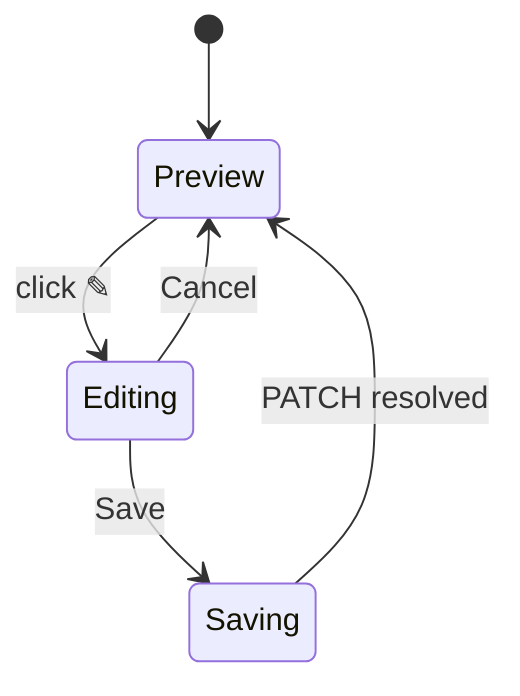

# Application Documents

## Purpose

The Documents section manages the two versioned application documents: the **tailored
resume** and the **cover letter**. Each is generated by the AI workflow
(`application_resume` / `application_cover_letter` executions) and stored as markdown
content with a version number.

## High-Level Layout

```text
DOCUMENTS
┌────────────────────────────────────────┐  ┌────────────────────────────────────────┐
│ [📄] Tailored Resume        v2   [🗑]  │  │ [📄] Cover Letter           v1   [🗑]  │
│      [👁] [copy] [↓] [PDF] [✎] [⚡ Regenerate]│  │      [👁] [copy] [↓] [PDF] [✎] [⚡ Regenerate]│
│ ┌────────────────────────────────────┐ │  │ ┌────────────────────────────────────┐ │
│ │ # Staff Engineer Resume            │ │  │ │ Dear Hiring Team,                 │ │
│ │ ... markdown preview (max-h, scroll)│ │  │ │ ...                              │ │
│ └────────────────────────────────────┘ │  │ └────────────────────────────────────┘ │
│ Updated Aug 11, 2026                    │  │ Updated Aug 11, 2026                    │
└────────────────────────────────────────┘  └────────────────────────────────────────┘
```

> `[👁]` is the new **Preview** action (added in Prompt 161); `[PDF]` is the
> **Download as PDF** action (added in Prompt 175).

## Component Hierarchy

```text
ApplicationDocuments
├── DocumentCard (tailored_resume)   resume = documents.find(type === 'tailored_resume')
└── DocumentCard (cover_letter)      coverLetter = documents.find(type === 'cover_letter')
```

Each `DocumentCard`:

```text
DocumentCard
├── Header          icon + label + version + actions (preview, copy, download, PDF, edit, delete, generate)
├── Edit panel      Textarea + [Cancel] [Save]  (when editing)
├── Preview         scrollable markdown <pre>   (when not editing)
├── Meta line       "Updated <DateTime>"
└── PreviewDialog   A4 page dialog (opens from the 👁 action)
```

## A4 Preview Dialog

The **Preview** (`👁`) action (rendered only when a document exists) opens a
full dialog that renders the document markdown as a **continuous A4-width
page** (210mm wide, white paper, ~18-22mm margins). The sheet's height grows
with the content, so a long resume/cover letter reads as one scrollable
document top-to-bottom (like a multi-page PDF) rather than overflowing a single
fixed A4 box. Text is rendered as selectable DOM content via `react-markdown`
with PDF-like typography.

```text
┌──────────────────────────────────────────────────────────────┐
│ Tailored Resume — Preview                       [✕]          │
│ A4-width preview · text is selectable                        │
├──────────────────────────────────────────────────────────────┤
│  ┌──────────────────────────────────────────────────────┐    │
│  │  (A4-width sheet · white · 210mm wide)               │    │
│  │  Hassan Khaled                                       │    │
│  │  Senior Backend Engineer                             │    │
│  │                                                      │    │
│  │  ## Experience                                       │    │
│  │  • ...                                               │    │
│  │  (height grows with content — scrolls vertically)    │    │
│  └──────────────────────────────────────────────────────┘    │
└──────────────────────────────────────────────────────────────┘
```

| Aspect | Behavior |
| ------ | -------- |
| Trigger | Preview `👁` button in the document card header (only when a document exists). |
| Layout | Wide dialog; A4-width sheet centered in a scrollable area; the sheet grows with content instead of clipping at one page. |
| Rendering | `react-markdown` renders the markdown; raw HTML is escaped. |
| Selectable | Sheet sets `user-select: text`; text can be selected/copied. |
| Long content | No fixed page height — the sheet continues below the first A4 height and the dialog scrolls. |

## Behaviors

| Element | Behavior |
| ------- | -------- |
| Generate | No document → `[⚡ Generate]`; sends `POST /api/applications/{id}/documents/{type}/generate` (202). SSE progress + refetch on completion. |
| Regenerate | Document exists → `[⚡ Regenerate]`; queues a new version. |
| Preview | `[👁]` opens the A4 preview dialog rendering the markdown as a selectable PDF-like page. |
| Copy | Copies the full markdown content to the clipboard; icon becomes a green check briefly. |
| Download | Blob-downloads the content as `{label}-v{version}.md` (text/markdown). |
| Download PDF | `[PDF]` calls `GET /api/applications/documents/{id}/pdf`; downloads the server-rendered PDF as `{label}-v{version}.pdf`. The document's `{{token}}` placeholders are filled with the user's saved Placeholder values before rendering (see the Placeholders page). |
| Edit | Opens an inline `Textarea` prefilled with the content; [Save] → `PATCH /api/applications/documents/{id} {content}`; [Cancel] discards. |
| Delete | `DELETE /api/applications/documents/{id}` → removes the document card back to the generate state. |

## Empty States

```text
┌────────────────────────────┐  ┌────────────────────────────┐
│ TAILORED RESUME   [⚡ Generate]│  │ COVER LETTER   [⚡ Generate]  │
│ No tailored resume yet.     │  │ No cover letter yet.      │
│ Generate one from the job   │  │ Generate one from the job │
│ analysis and your profile.  │  │ analysis and your profile.│
└────────────────────────────┘  └────────────────────────────┘
```

- A document with empty content renders `(empty)` in the preview.

## Generating State

- While `generating` and no document: button spinner + "Generating tailored resume…".
- Full workflow progress is shown by the page-level `GenerationProgress` SSE card.

## Editing State



# Related Documents

- `docs/ux/features/applications/workspace.md` (page container)
- `docs/ux/features/placeholders/placeholders.md` (the `{{token}}` values the PDF fills)
- `docs/ux/flows/applications/generate-application-artifacts.md` (generation journey)
