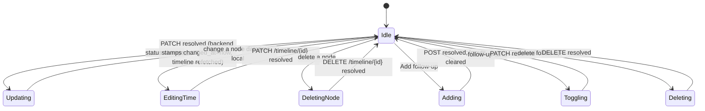

# Application Tracker

## Purpose

The Application Tracker is the first section of the Job Application Workspace. It holds
the application's **status** (which records a status **timeline**), and a minimal list
of **follow-ups**. It is intentionally not a CRM — follow-ups stay minimal (a date, a
note, a done toggle). The timeline traces every status change with its time.

## High-Level Layout

```text
┌──────────────────────────────────────────────────────────────┐
│ APPLICATION                                                  │
│  Status [ Applied ▾ ]                                        │
│  ──────────────────────────────────────────────────────────── │
│  APPLICATION TIMELINE                                        │
│  [ Recommended ] [ 2026-08-11 09:00 ▾ ]            [🗑]      │
│  [ Preparing   ] [ 2026-08-12 14:30 ▾ ]            [🗑]      │
│  [ Applied     ] [ 2026-08-15 10:15 ▾ ]            [🗑]      │
│  Selecting a new status records its time automatically;      │
│  edit or remove entries here.                                │
│  ──────────────────────────────────────────────────────────── │
│  FOLLOW-UPS                                                   │
│  ☑ Follow up after interview · Sep 1, 2026              [🗑]   │
│  ☐ Ask about visa timeline                           [🗑]   │
│  ──────────────────────────────────────────────────────────── │
│  [ Note (e.g. follow up after interview) ] [ 📅 ] [ Add ]     │
└──────────────────────────────────────────────────────────────┘
```

## Component Hierarchy

```text
ApplicationTracker
├── Status select   (Select → PATCH /api/applications/{id} {status})
├── Application Timeline
│   ├── Timeline row  Status badge · datetime-local input · delete
│   │                 (input → PATCH /api/applications/timeline/{id})
│   │                 (delete → DELETE /api/applications/timeline/{id})
└── Follow-ups
    ├── Follow-up row   ☐/☑ toggle · note · scheduled date · delete
    └── Add row         note input + date input + [Add]
```

## Behaviors

| Element | Behavior |
| ------- | -------- |
| Status select | Options: `recommended`, `preparing`, `ready_to_apply`, `applied`, `interview`, `offer`, `accepted`, `rejected`, `withdrawn`. On change → `PATCH /api/applications/{id} {status}`. The backend records a new timeline node with `changed_at = now`. This is the job-tracking status surfaced on the Jobs list and drawers — see `docs/ux/features/jobs/tracking.md`. |
| Timeline time | Each node shows its `changed_at` as a `datetime-local` input. Editing it commits `PATCH /api/applications/timeline/{id} {changed_at}` (ISO with local offset). |
| Timeline delete | Trash icon (visible on row hover) → `DELETE /api/applications/timeline/{id}`. Removes that node from the history. |
| Follow-up toggle | Circle button `☐`/`☑`; toggling sends `PATCH /api/applications/follow-ups/{id} {completed: true|false}`. Completed rows render the note struck-through and dimmed. |
| Follow-up delete | Trash icon (visible on row hover) → `DELETE /api/applications/follow-ups/{id}`. |
| Add follow-up | Note (text) + optional date. Button disabled when both empty. Sends `POST /api/applications/{id}/follow-ups {note, scheduled_at?}`; inputs clear on success. |

## Timeline State Flow



## Empty State

```text
  APPLICATION TIMELINE
  No status changes recorded yet.

  FOLLOW-UPS
  No follow-ups scheduled yet.
```

## Error States

- Any mutation failure → toast "Failed to …".

# Related Documents

- `docs/ux/features/applications/workspace.md` (page container)