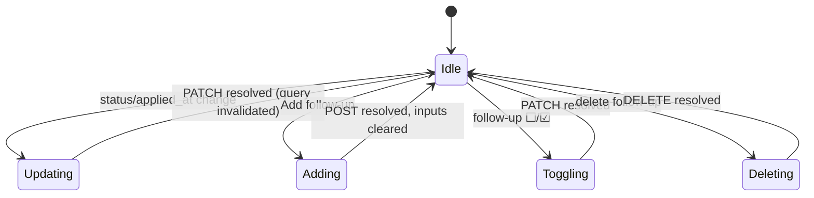

# Application Tracker

## Purpose

The Application Tracker is the first section of the Job Application Workspace. It holds
the application's **status**, the **applied date**, and a minimal list of **follow-ups**.
It is intentionally not a CRM — follow-ups stay minimal (a date, a note, a done toggle).

## High-Level Layout

```text
┌──────────────────────────────────────────────────────────────┐
│ APPLICATION                                                  │
│  Status [ Recommended ▾ ]   Applied at [ 2026-08-11 ]        │
│  ──────────────────────────────────────────────────────────── │
│  FOLLOW-UPS                                                   │
│  ☑ Follow up after interview · Sep 1, 2026              [🗑]   │
│  ☐ Ask about visa timeline                           [🗑]   │
│  ──────────────────────────────────────────────────────────── │
│  [ Note (e.g. follow up after interview) ] [ 📅 ] [ Add ]     │
└──────────────────────────────────────────────────────────────┘
```

## Component Hierarchy

```text
ApplicationTracker
├── Status select   (Select → PATCH /api/applications/{id})
├── Applied at      (native date input → PATCH applied_at)
└── Follow-ups
    ├── Follow-up row   ☐/☑ toggle · note · scheduled date · delete
    └── Add row         note input + date input + [Add]
```

## Behaviors

| Element | Behavior |
| ------- | -------- |
| Status select | Options: `recommended`, `preparing`, `ready_to_apply`, `applied`, `rejected`, `withdrawn`. On change → `PATCH /api/applications/{id} {status}`. Default is `recommended` at creation. |
| Applied at | Date input bound to `applied_at` (first 10 chars). Clearing the field sends `applied_at: null`. |
| Follow-up toggle | Circle button `☐`/`☑`; toggling sends `PATCH /api/applications/follow-ups/{id} {completed: true|false}`. Completed rows render the note struck-through and dimmed. |
| Follow-up delete | Trash icon (visible on row hover) → `DELETE /api/applications/follow-ups/{id}`. |
| Add follow-up | Note (text) + optional date. Button disabled when both empty. Sends `POST /api/applications/{id}/follow-ups {note, scheduled_at?}`; inputs clear on success. |

## State Diagram



## Empty State

```text
  FOLLOW-UPS
  No follow-ups scheduled yet.
```

## Error States

- Any mutation failure → toast "Failed to …".

# Related Documents

- `docs/ux/features/applications/workspace.md` (page container)
