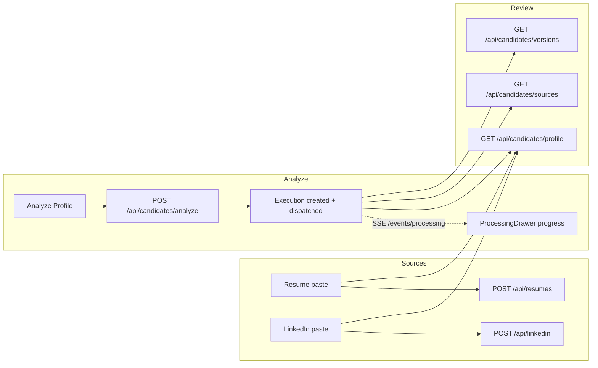
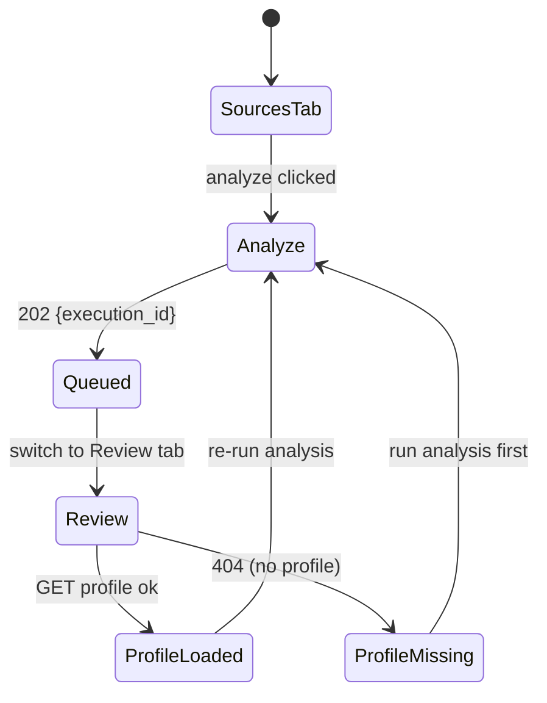

# Candidate Profile Import Page

## Purpose

The Candidate Profile Import page is the first page of the Candidate module.
It lets the user import their professional information (resume, LinkedIn, and
an optional GitHub placeholder), run AI profile analysis, and review the
resulting canonical candidate profile (skills, experience, projects, sources,
summary).

Actions available on this page:

- Upload / replace the resume (paste text).
- Upload / replace the LinkedIn profile (paste text).
- Enter a GitHub username (optional, placeholder for a future phase).
- Run **Analyze Profile** — queues candidate processing via
  `POST /api/candidates/analyze`.
- Review the extracted profile, connected sources and version history.
- Confirm / retry the analysis (post-hoc confirm model: extraction already
  persists; Confirm acknowledges the result).

## Design Principles

- Two-tab layout: **Sources** (input) and **Review** (output).
- Reuses the existing paste-text upload pattern from the Resume page — no new
  upload widgets.
- GitHub is clearly marked as a placeholder.
- Profile analysis is a background workflow; the UI queues it and lets the user
  switch to Review to see the latest persisted profile.

# High-Level Layout

```text
┌──────────────────────────────────────────────────────────────────────────┐
│ Candidate Profile                                        [nav: Candidate]│
├──────────────────────────────────────────────────────────────────────────┤
│ [Sources] [Review]                                                       │
├──────────────────────────────────────────────────────────────────────────┤
│ ┌──────────────────────────┐  ┌──────────────────────────┐              │
│ │ RESUME (card)            │  │ LINKEDIN (card)          │              │
│ │  ✎ paste textarea        │  │  ✎ paste textarea        │              │
│ │  [Save Resume]           │  │  [Save Profile]          │              │
│ └──────────────────────────┘  └──────────────────────────┘              │
│ ┌────────────────────────────────────────────────────────────────────┐  │
│ │ GITHUB (optional, card) — username input  [placeholder]             │  │
│ └────────────────────────────────────────────────────────────────────┘  │
│ ┌────────────────────────────────────────────────────────────────────┐  │
│ │ ANALYZE PROFILE (card)                                             │  │
│ │  [✨ Analyze Profile]                     (queues candidate run)    │  │
│ └────────────────────────────────────────────────────────────────────┘  │
├──────────────────────────────────────────────────────────────────────────┤
│  [Review tab]                                                           │
│ ┌────────────────────────────────────────────────────────────────────┐  │
│ │ PROFILE SUMMARY (card)  name · title · version · location           │  │
│ │ headline / summary                                                  │  │
│ │ [2 skills] [1 experience] [1 project] [1 education] [1 language]    │  │
│ └────────────────────────────────────────────────────────────────────┘  │
│ ┌──────────────────────────┐  ┌──────────────────────────┐              │
│ │ CONNECTED SOURCES        │  │ VERSION HISTORY          │              │
│ │  resume v1 [processed]   │  │  v2 "added linkedin"     │              │
│ │  linkedin v1 [processed] │  │  v1 "initial import"     │              │
│ └──────────────────────────┘  └──────────────────────────┘              │
│ ┌────────────────────────────────────────────────────────────────────┐  │
│ │ SKILLS  [Python L4 96%] [PostgreSQL L4 90%] ...                    │  │
│ ├────────────────────────────────────────────────────────────────────┤  │
│ │ EXPERIENCE  role · company · dates · summary                       │  │
│ ├────────────────────────────────────────────────────────────────────┤  │
│ │ PROJECTS  name · description · url                                 │  │
│ └────────────────────────────────────────────────────────────────────┘  │
└──────────────────────────────────────────────────────────────────────────┘
```

# Component Hierarchy

```text
ProfileImportPage
├── PageHeader
├── Tabs (Sources | Review)
├── Sources tab
│   ├── SourceCard (Resume)      → Textarea + [Save Resume]
│   ├── SourceCard (LinkedIn)    → Textarea + [Save Profile]
│   ├── GitHub card              → Input (placeholder)
│   └── Analyze card             → [✨ Analyze Profile]
└── Review tab
    ├── ProfileReview            → summary + badge counts
    ├── SourcesCard              → source list
    ├── VersionsCard             → version history
    ├── SkillCloud               → skill badges
    ├── ExperienceList
    └── ProjectList
```

# Component/Data Flow



# State Diagram



# Behaviors

| Element | Behavior |
| --- | --- |
| Sources tab | Default tab. Resume + LinkedIn paste cards, GitHub placeholder, Analyze card. |
| Save Resume | `POST /api/resumes` with `{ raw_text }`; toast on success; clears textarea. |
| Save Profile | `POST /api/linkedin` with `{ raw_text }`; toast on success; clears textarea. |
| GitHub input | Stored locally only; marked "not yet available" (adapter is a stub). |
| Analyze Profile | `POST /api/candidates/analyze`; returns `{ execution_id, status }`; toast "queued"; switches to Review. |
| Review tab | Fetches `/api/candidates/profile`, `/sources`, `/versions` on mount and after analysis via React Query invalidation. |
| Confirm / retry | Post-hoc confirm: no separate confirm step; re-running analysis is the retry path. |

# Empty States

```text
┌──────────────────────────────────────┐
│ No profile yet.                      │
│ Add your resume / LinkedIn sources   │
│ and run [✨ Analyze Profile].        │
└──────────────────────────────────────┘
```

- Connected Sources: "No sources imported yet."
- Version History: "No profile versions yet."
- Skills / Experience / Projects sections are hidden when empty.

# Loading States

- Review tab: "Loading profile..." while `GET /profile` is in flight.
- Analyze button: label becomes "Queuing analysis..." and is disabled while the
  mutation is pending.

# Error States

- Profile fetch failure: "Could not load the candidate profile." + [Retry].
- Analyze failure: toast "Failed to start profile analysis"; inline error text
  under the Analyze button.

# Responsive Behavior

- Two source cards stack into a single column on small screens (`lg:grid-cols-2`
  → one column below `lg`).
- Source/version cards sit side by side on wide screens, stacked on mobile.

# Navigation

- Nav item **Candidate** (`/candidate`) between Companies and Skills.
- No cross-page navigation yet; dashboard (110 Phase 2) will become the landing
  page in a later phase.

# Related Documents

- `docs/ux/flows/candidate/import-profile.md` (user journey)
- `docs/ux/features/skills/skill-detail.md` (existing Roadmap tab — will be
  replaced in the 110 Phase 8 roadmap phase)
- `DESIGN.md` (nav tree + wireframes)
