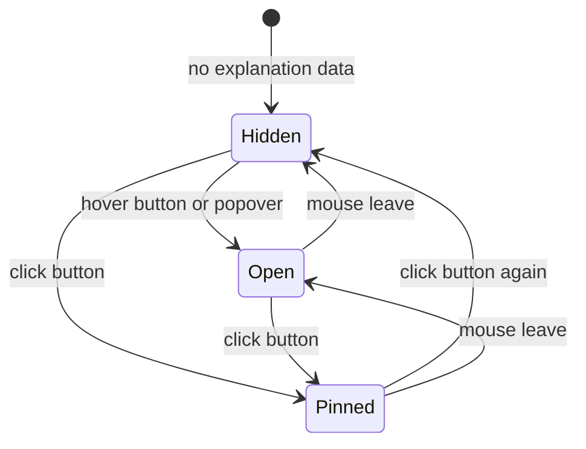

# Company Detail

## Purpose

The Company Detail drawer shows a company's intelligence, scores, notes, and
linked jobs in a single scrollable page — the same pattern as the Job Detail
drawer. It is the successor to the legacy `CompanyDrawer`, migrated from the
legacy `AppDrawer` to the shared vaul `Drawer` and driven by react-query. There are
no tabs; company-exclusive sections are ordered by importance for a
visa-seeking software engineer.

---

# Drawer Layout

```text
┌──────────────────────────────────────────────┐
│ Company Details       [Reprocess] [Edit]  ✕  │
├──────────────────────────────────────────────┤
│ [A+]  Fit 85  Success 90  Overall 88   🔗Web │
│ ◉ Acme GmbH                          🔗Ext.  │
│ Software Development                        │
│ 📍 Berlin, Germany  👥 51-200  Product Co.   │
│ 💼 12 jobs                                   │
│ ◈ Related Companies                 [Manage] │
│                                              │
│ <Recommendation>                             │
│ <Recruiter for N jobs (recruiter types only)>│
│ <Company Overview / description>             │
│ <Intelligence sections, importance order>    │
│ <Linked jobs>                                │
│ <Notes & Links — read only>                  │
│ <Scores explanation: Why popover in header>  │
└──────────────────────────────────────────────┘
```

---

# Header

- Overall grade badge (derived from the overall score, A++ … D)
- Fit / Success / Overall score cards
- Link column at the top-right of the score strip:
  - Website link first (opens `company.website` in a new tab) when a website
    exists
  - The remaining `company.links` listed beneath it (any link whose URL equals
    the website is skipped), each opening in a new tab
  - Mirrors the Job Detail drawer's "Open job posting" link placement
- Company name + logo
- Industry
- Badges: location, company size, company type, linked-job count
- **Adaptive job-count badge** in the header, matching the list column:
  - Product / other companies — `N jobs` (hiring count, `job_count`)
  - Recruiter-type companies (`RECRUITING_AGENCY` / `STAFFING_COMPANY`) —
    `N listed` (jobs listed for clients, `recruiter_job_count`)

## Header Actions

- **Reprocess** — a ghost button in the top-right of the drawer header, before
  Edit (mirrors the Job Detail drawer's `[Action] [Edit]` layout). It
  re-enqueues the company for processing.
- **Edit** — a ghost button in the top-right of the drawer header, next to
  Reprocess, beside the "Company Details" title. It opens the **Edit Company**
  drawer for the same company (`CompanyEditDrawer`), reusing the page-level edit
  state. The detail drawer stays open underneath.

---

# Page Sections (single page, no tabs)

## Related Companies

Sits between the header badges and the Recommendation section. Shows the
main/alias relationship (see `relate-company.md`):

- Alias: `Part of <main name>`
- Main with aliases: `N related companies`
- Otherwise: `No related companies`

A `Manage` button opens the Relate Company dialog.

## Recommendation

`company.intelligence.recommendation`, prioritized to the top of the drawer.
Rendered as a highlighted card: priority badge, observation, action, evidence,
impact, ideal role, timing.

## Recruiter for

Shown only for recruiter-type companies (`RECRUITING_AGENCY` /
`STAFFING_COMPANY`) that publish jobs on behalf of hiring companies. Sits
between the Recommendation card and the Intelligence sections.

The section header reads **"Recruiter for N jobs"** (total recruiter jobs with
an attributed hiring company). Each hiring company is grouped as a row with its
name (a link to that company's detail drawer on the Companies page) and the
count of jobs published for it. Under each hiring company, the **individual
jobs** are listed as links (job title) that open the job's detail drawer on the
Jobs page (`/jobs?job=<id>`). The job links are the primary action; the hiring
company link is a secondary reference.

```text
┌─ Recruiter for 3 jobs ───────────────────────────────────┐
│ Acme GmbH                             2 jobs            │
│ Beta GmbH                             1 job             │
└──────────────────────────────────────────────────────────┘
```

Data comes from the detail payload: `recruiter_for` (rows of `company_id`,
`name`, `job_count`) and `recruiter_job_count`. Jobs whose only hiring company
is the recruiter itself are excluded.

## Company Overview

`company.description` plus the intelligence "Company Overview" section
(products, founded, headquarters, size, countries, market position, funding,
growth trajectory).

## Intelligence

Rendered from the detail payload (`company.intelligence`). The **product-company**
variant orders sections by importance for the user's visa-sponsorship goal:

1. Company Overview
2. Visa & Relocation Signals
3. Work Environment
4. Engineering Culture
5. Technology Stack
6. Growth Opportunities

The **recruiter** variant (for `RECRUITING_AGENCY` / `STAFFING_COMPANY`)
keeps its own ordering:

1. Recruiter Overview
2. International Hiring
3. Work Environment

## Scores

The scores shown in the header (grade badge + Fit / Success / Overall cards)
are exactly the scores **calculated by company processing**
(`fit` / `success` → weighted `overall`), persisted into
`company.intelligence.scores` and surfaced through the normalized top-level
`company.scores` field. The drawer reads `company.scores` first and falls back
to the raw `intelligence.scores` dict; this mirrors the Job Detail drawer, which
reads the same normalized `scores` payload.

### Scores Explanation

A **Why** button sits next to the score cards in the header (hidden when no
explanation data exists — e.g. legacy/unprocessed companies). It mirrors the Job
Detail drawer's explanation popover:

- **Hover** over the button (or the popover) opens it.
- **Click** pins it open (sticky); clicking again unpins.
- It closes on **unhover** (mouse leave) or **unpin**.

The popover shows the intelligence `fit` / `success` explanations and their
positive / negative factors:

```text
┌─ Scores Explanation ────────────────────────────────┐
│ WHY IT FITS                                          │
│ Strong stack alignment                               │
│  • Go + Postgres match          (positive, green)    │
│  • No Kafka experience          (negative, red)      │
│ CHANCE OF SUCCESS                                    │
│ Growing team                                         │
│  • Clear engineering roadmap    (positive, green)    │
│  • Small team                   (negative, red)      │
└──────────────────────────────────────────────────────┘
```



The old full-width score breakdown cards (Overall grade card, Fit score card,
Success score card, Score calculation) were removed; the header score strip is
now the single score display.

## Linked Jobs

`CompanyJobsTab` — lists `company.jobs` from the detail payload. Each row shows
the job's role, location, and its Fit / Success / Overall scores with an
overall grade badge (up to 5 rows, "Show all" expands the rest). Clicking a job
deep-links to `/jobs?job=<id>`, where the Jobs page opens that job's detail
drawer on mount.

```text
┌─ Linked Jobs ────────────────────────────────────────────┐
│ 3 linked jobs                                            │
│ Senior Backend Engineer                    [B]           │
│  Berlin, Germany   [Fit 84][Success 63][Overall 76]      │
│ Platform Engineer                           [A]          │
│  Munich, Germany   [Fit 90][Success 70][Overall 82]      │
│ ...                                                      │
│ [Show all 3 jobs]                                        │
└──────────────────────────────────────────────────────────┘
```

## Notes (read only)

Read-only list of `company.notes` from the detail payload. Notes are added and
edited in the **Edit Company** drawer, not here.

## Links (read only)

Read-only list of `company.links` from the detail payload. Links are added and
edited in the **Edit Company** drawer, not here.

## Top Actions

The drawer no longer has a bottom footer with action buttons. Actions moved
into the header/score strip, mirroring the Job Detail drawer:

- Links column at the top-right of the score strip — Website first, then the
  remaining `company.links` beneath it; each opens in a new tab (any link equal
  to the website is skipped)
- Reprocess (re-enqueues the company for processing) — in the drawer header
  next to Edit

The "View All Jobs" and "Delete" buttons were removed. Job navigation happens
per-row inside the **Linked Jobs** section; deleting a company is done via the
row actions on the Companies page, not inside the detail drawer.

---

# Data Source

The drawer loads the company once via `useCompanyQuery(id)`, which calls
`GET /api/companies/list/{id}` and returns all company data (base fields,
status, notes, links, intelligence, scores, jobs) in a single payload. Each
section reads from that payload; no `/links`, `/jobs` or local-history
requests are made by the drawer.

---

# Related Documents

- `docs/ux/features/companies/page.md`
- `docs/ux/features/companies/company-row.md`
- `docs/ux/features/companies/edit-company.md`
