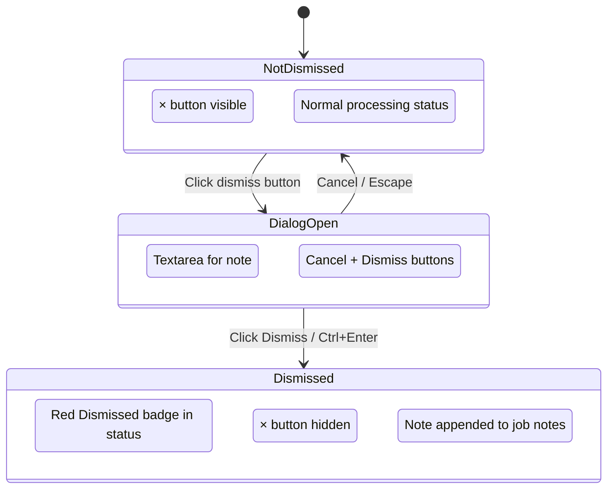

# Dismiss Job

## Purpose

The Dismiss action lets the user mark a Job they are not interested in.
Dismissed jobs remain visible in the list but are highlighted with a red
"Dismissed" badge in the Processing column so they stand out from active jobs.

Dismissed is a lightweight, user-managed flag. It is independent of the analysis
pipeline and does not affect scoring or recommendation.

---

# Related Page

Located in:

- `features/jobs/page.md`
- `features/jobs/job-row.md`

Triggered from the **Dismiss** button on a **Job Row**.

Related:

- `api/jobs/list-jobs.md`

---

# Trigger

The **Dismiss** button (`×`) sits next to the Pin button in the row's action
area. It is only shown for non-dismissed jobs.

The button is a separate interactive element. Clicking it never triggers row
selection (opening the Job Details drawer).

---

# User Goals

The user should be to:

- Dismiss a job they are not interested in with an optional reason
- See at a glance which jobs are dismissed (red badge in status column)
- Dismissed jobs stay in the list for context

---

# User Flow

```text
Open Jobs Page

↓

Click dismiss (×) on a Job Row

↓

Dismiss Dialog opens

  ┌─ Dismiss job ──────────────────────────┐
  │ Dismiss "Senior Engineer"?             │
  │ It will be marked as dismissed...       │
  │                                         │
  │ ┌───────────────────────────────────┐   │
  │ │ Why are you dismissing this?      │   │
  │ │ (optional)                        │   │
  │ └───────────────────────────────────┘   │
  │                     [Cancel] [Dismiss]  │
  └─────────────────────────────────────────┘

↓

User types a reason (optional) and clicks Dismiss

↓

PUT /api/jobs/{job_id}/dismissed { dismissed: true, note: "..." }

↓

Success:
- Job row shows red "Dismissed" badge in Processing column
- Dismiss button (×) disappears from the row
- If note was provided, it is appended to the job's notes
```

---

# Dismiss Dialog

The dialog appears when the user clicks the dismiss button.

## Layout

```text
┌─ Dismiss job ──────────────────────────┐
│                                        │
│ Dismiss "Senior Engineer"?             │
│ It will be marked as dismissed in      │
│ the list.                              │
│                                        │
│ ┌───────────────────────────────────┐  │
│ │ Why are you dismissing this?      │  │
│ │ (optional)                        │  │
│ └───────────────────────────────────┘  │
│ Ctrl+Enter to dismiss                  │
│                                        │
│                     [Cancel] [Dismiss] │
└─────────────────────────────────────────┘
```

## Controls

| Control  | Description                                      |
| -------- | ------------------------------------------------ |
| Textarea | Optional reason for dismissal (free text)        |
| Cancel   | Closes the dialog without dismissing             |
| Dismiss  | Dismisses the job and optionally saves the note  |

## Keyboard

- `Ctrl+Enter` / `Cmd+Enter` — Dismiss
- `Escape` — Cancel

---

# States

## Idle

The row shows a `×` dismiss button next to the pin. Tooltip: *Dismiss — mark as dismissed*.

## Dialog Open

The dismiss dialog is shown. The textarea is focused automatically.

## Dismissing

The Dismiss button in the dialog shows a loading state.

## Success

- The `×` button disappears from the row
- A red "Dismissed" badge appears in the Processing column
- If a note was provided, it is appended to the job's notes

---

# Dismissed Status

Dismissed jobs show a red "Dismissed" badge in the Processing column instead of
their processing status.

```text
┌──────────────┐
│ Dismissed    │   (red badge, bg-red-500/10, text-red-500)
└──────────────┘
```

The badge uses:
- Background: `bg-red-500/10`
- Text: `text-red-500`
- Border: `border-red-500/20`

---

# Accessibility

- The dismiss button has an accessible label ("Dismiss job").
- The dialog has a clear title and description.
- The textarea is auto-focused when the dialog opens.
- Cancel and Dismiss buttons are keyboard accessible.

---

# Related Documents

- `features/jobs/page.md`
- `features/jobs/job-row.md`
- `api/jobs/list-jobs.md`

---

# State Diagram


