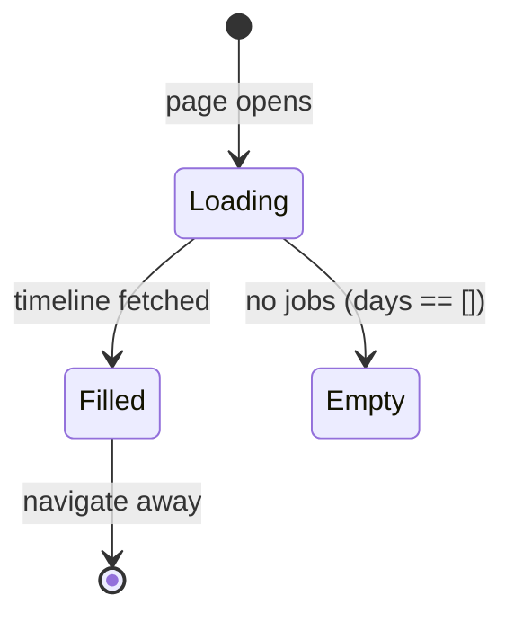

# Jobs Created Timeline

## Purpose

A narrow, independently-scrollable panel alongside the Jobs list that shows the
number of jobs created **per day**, newest first. Months are separated by a line
with the month name ("Aug 2026") centered in it.

The timeline is **display-only and independent of the list** — it is not affected
by the current search/filter/pagination and does not filter the list on click. It
reports all non-deleted jobs ever created.

## Layout

```text
JOBS PAGE
┌─────────────────────────────────────────────────────────────────┬───────────────┐
│ Jobs Header (total · Add · Queue)                               │               │
│ ──────────────────────────────────────────────────────────────── │  JOBS ADDED   │
│ [ toolbar: search · filters · columns ▾ ]                       │ ┌─────────────┐│
│ ┌─────────────────────────────────────────────────────────────┐ │ │── Aug 2026 ││
│ │ Jobs list (infinite scroll, own scroll)                     │ │ │──────────────││
│ │ # Title  Company  Location  …                              │ │ │ Aug 19     3 ││
│ │ # Title  Company  Location  …                              │ │ │ Aug 18     5 ││
│ │ …                                                          │ │ │ Aug 15     2 ││
│ └─────────────────────────────────────────────────────────────┘ │ │──────────────││
│                                                                 │ │── July 2026  ││
│                                                                 │ │──────────────││
│                                                                 │ │ Jul 30     4 ││
│                                                                 │ │ … (scroll)   ││
└─────────────────────────────────────────────────────────────────┴──┴─────────────┴┘
```

The timeline is a narrow ~96px (`w-24`) column on the **right** edge of the card,
separated by a vertical border. It has its own vertical scrollbar
(`overflow-y-auto`) that is independent of the list's scroll.

## Anatomy

| Element | Behavior |
| ------- | -------- |
| Header | "JOBS ADDED" label pinned at the top of the panel. |
| Month divider | A horizontal line with the month name ("Aug 2026") centered; rendered whenever the month changes (once per month). |
| Day row | `Day` (e.g. `Aug 19`) on the left, `count` on the right (tabular numerals, primary color). |
| Empty state | "No jobs yet" when there are no records. |
| Loading state | "Loading…" while the timeline query resolves. |

## States



## Data Source

- `GET /api/jobs/timeline` → `{ days: [{ date: "YYYY-MM-DD", count }], total }`,
  ordered **newest first**. `total` is the sum of all day counts.
- Counts are grouped by the day portion of `jobs.created_at` (a Text ISO column)
  over non-deleted jobs only — independent of the active list filters.
- The timeline refetches on a 30s stale-time window; it is **not** tied to the
  list's infinite scroll.

## Related Documents

- `docs/ux/features/jobs/page.md` — the Jobs page container.
- `docs/api/API.md` — endpoint overview.
- `implementation-history/178_feature_job_created_timeline.md` — this implementation.