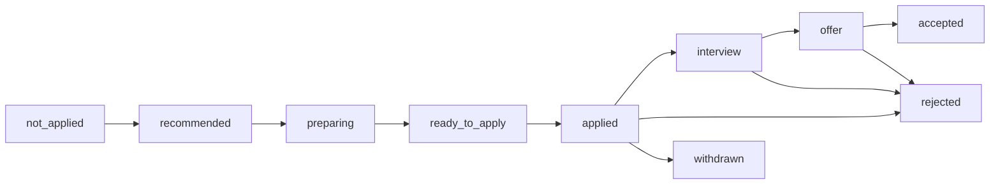

# Job Tracking Status

## Purpose

The Jobs page shows a **Tracking** column and filter that reflect where each job
stands in the **application funnel**: not applied → applied → interview → offer →
accepted (or rejected / withdrawn). The tracking status is derived from the
job's **application status** (the Applications context); a job with no
application shows **Not Applied**. It complements the existing **Status**
(processing) column rather than replacing it.

## Source of Truth

The tracking status is the application's status (`application.applications.status`).
Values:

| Value | Meaning |
| ----- | ------- |
| `not_applied` | The job has no application record (derived, not stored). |
| `recommended` | Application created; not yet prepared. |
| `preparing` | Preparing materials. |
| `ready_to_apply` | Materials ready; not yet submitted. |
| `applied` | Application submitted. |
| `interview` | Interviewing with the company. |
| `offer` | Received an offer. |
| `accepted` | Offer accepted / hired. |
| `rejected` | Rejected by the company. |
| `withdrawn` | Application withdrawn. |

The tracking value is **not stored on the job** (no new job column). It is
resolved on read by the Jobs API via the application repository (logical
`job_id` reference, AGENTS.md rule 15).

## Jobs List (column + filter)

```text
┌───────┬───────────┬─────────┬─────────┬─────────┬──────────┬─────────┬───────────┬───────────┬─────────┐
│ Title │ Company   │ Location│ Scores  │ Rec     │ Tracking │ Status  │ Updated   │ Created   │ Actions │
├───────┼───────────┼─────────┼─────────┼─────────┼──────────┼─────────┼───────────┼───────────┼─────────┤
│ Staff │ Acme GmbH │ Berlin  │ A+ F85  │ Apply   │ [Applied]│ Running │ 2m ago    │ 1d ago    │  ⋯      │
│ SWE   │           │         │ S88 O90 │         │          │         │           │           │         │
├───────┼───────────┼─────────┼─────────┼─────────┼──────────┼─────────┼───────────┼───────────┼─────────┤
│ Kafka │ DataOps   │ Remote  │ B  F72  │ Consider│ [Interview]│ Completed│ 5m ago  │ 3d ago    │  ⋯      │
│ Eng   │           │         │ S80 O75 │         │          │         │           │           │         │
└───────┴───────────┴─────────┴─────────┴─────────┴──────────┴─────────┴───────────┴───────────┴─────────┘
```

- **Tracking column**: a color-coded badge (`TrackingBadge`) between the Rec and
  Status columns. Jobs without an application show the gray **Not Applied** badge.
- **Tracking filter** (`JobsToolbar`): a select labeled **Tracking** with options
  All / Not Applied / Applied / Interview / Offer / Accepted / Rejected / Withdrawn.
  It maps to the `tracking_status` query param on `GET /api/jobs/list` and counts
  toward the active-filter count / Clear button.

### Filter semantics

- `tracking_status=not_applied` → excludes every job that has an application.
- `tracking_status=<status>` → returns only jobs whose application status matches.
- Combined with the processing-status filter (e.g. `applied` + `completed`).

## Job Detail / Job Edit Drawers

Both drawers show a read-only **Tracking** badge:

- **Job Detail drawer**: a "Tracking" row in the details grid showing the badge.
- **Job Edit drawer**: a read-only "Tracking" field showing the badge with a hint
  ("Edit in the application workspace"). The tracking status is **not editable**
  here; it is changed via the application status select in the application
  workspace.

## Application Workspace

The application status select (`ApplicationTracker`) and badge
(`ApplicationStatusBadge`) now include the new funnel values
`interview`, `offer`, and `accepted` alongside the existing
recommended / preparing / ready_to_apply / applied / rejected / withdrawn.



## Backend

- `GET /api/jobs/list` gains a `tracking_status` query param and returns a
  `tracking_status` field on each item (derived via
  `statuses_by_job_ids` / `job_ids_with_application` on the application repo).
- `GET /api/jobs/{id}` returns `tracking_status` on the detail payload.
- The application PATCH accepts the new statuses (validated against
  `ApplicationStatus.ALL`).
