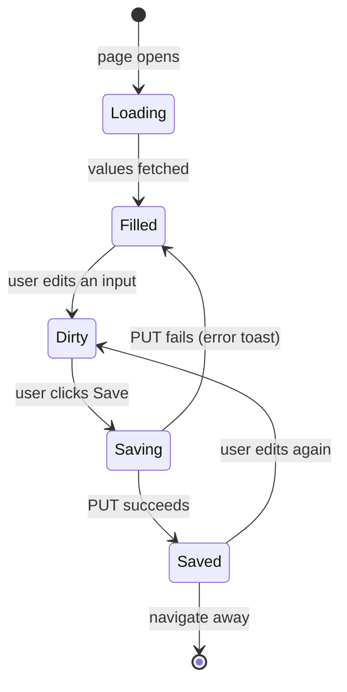

# Placeholders Page

## Purpose

The Placeholders page is where the user stores their personal details once, so they
are injected into every generated tailored resume and cover letter. From here the
user edits the `{{token}}` values that the Job Application Workspace substitutes
server-side when a document is previewed, copied, or downloaded as a PDF.

It lives at `/placeholders`, reachable from the left sidebar navigation (nav item
`placeholders`, "Placeholders").

## Layout

```text
┌──────────────────────────────────────────────────────────────────────────────┐
│  Placeholders                                          ← page heading        │
│  Personal details injected into generated resumes and  ← description        │
│  cover letters. Fill once, then use Download PDF on a                       │
│  generated document.                                                       │
│                                                                             │
│  ┌────────────────────────────────────────────────────────────────────────┐ │
│  │ Your details                                            ┌────────────┐ │ │
│  │ These values replace the {{name}} tokens in generated  │            │ │ │
│  │ documents.                                             │            │ │ │
│  │                                                        │            │ │ │
│  │  Full name            [ Hassan                    ]    │            │ │ │
│  │  Professional title   [ Senior Backend Engineer   ]    │            │ │ │
│  │  Email                [ hassan@example.com        ]    │            │ │ │
│  │  Phone                [ +49 000 000 000           ]    │            │ │ │
│  │  Location             [ Berlin, Germany           ]    │            │ │ │
│  │  LinkedIn URL         [ https://linkedin.com/in/..]    │            │ │ │
│  │  GitHub URL           [ https://github.com/..     ]    │            │ │ │
│  │  Headline             [ Building distributed systems ]  │            │ │ │
│  │  Professional summary [ 8+ years ...              ]    │            │ │ │
│  │                                                        │            │ │ │
│  │                                                    [ Save ]          │ │ │
│  └────────────────────────────────────────────────────────────────────────┘ │
└──────────────────────────────────────────────────────────────────────────────┘
```

The page is a single centered column (`max-w-2xl`) with a heading block and one
"Your details" card containing a labeled input per canonical placeholder key.

## Anatomy

| Element | Behavior |
| ------- | -------- |
| Heading + description | Static copy; explains the `{{name}}` token concept and where values are used. |
| Labeled inputs | One per canonical key (`name`, `title`, `email`, `phone`, `location`, `linkedin`, `github`, `headline`, `summary`), seeded from saved values. |
| Save button | Sends the whole edited set via `PUT /api/placeholders`; shows a success toast; clears the dirty buffer so saved values become the source of truth. |
| Saving state | Button label flips to "Saving…" and is disabled while the mutation is pending. |

## States



- **Loading**: placeholder spinner text while `GET /api/placeholders` resolves.
- **Filled / Saved**: inputs show the saved values; empty for keys not yet set.
- **Dirty**: edits are buffered locally (inputs reflect typed values immediately);
  nothing is persisted until Save.
- **Save failure**: the dirty buffer is kept so the user does not lose edits; an
  error toast is shown.

## Edge Cases

- A key that was never set shows an **empty input** (placeholder text = label).
- Unknown/unsaved keys are not submitted (only the edited map is sent).
- On save success the buffer is cleared; subsequent reads reflect the saved values.

## Related Documents

- `docs/domain/placeholders/placeholders.md` — entity model and business rules.
- `docs/api/placeholders/README.md` — Placeholders API.
- `docs/ux/features/applications/application-documents.md` — the Download PDF action
  that consumes these values.
- `docs/ux/DESIGN.md` — design system and overall product wireframes.