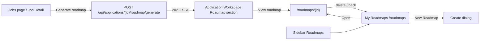

# My Roadmaps Page

## Purpose

"My Roadmaps" (`/roadmaps`) is the list page for the user's learning/job-preparation
roadmaps. It lists all saved roadmaps (AI-generated from a job application or created
manually), links to the detail page, and supports create / edit / delete. Version
history is Phase 2.

## Entry Points

- **Sidebar nav** "Roadmaps".
- After a roadmap is generated from the Application Workspace it appears here.
- Delete/return from a detail page lands back here.

## High-Level Layout

```text
┌───────────────────────────────────────────────────────────────────────┐
│ My Roadmaps                                             [+ New Roadmap]│
├───────────────────────────────────────────────────────────────────────┤
│ ┌────────────────────┐   ┌────────────────────┐   ┌────────────...   │
│ │ 🗺 Kafka Roadmap   │   │ 🗺 Career 2026     │   │                  │
│ │ Goal: JOB          │   │ Goal: CAREER       │   │                  │
│ │ [APPLICATION][ACTIVE]│  │ [MANUAL][ARCHIVED] │   │                  │
│ │ ▓▓▓▓▓▓░░░░░ 25%    │   │ ▓▓▓░░░░░░░ 50%    │   │                  │
│ │ 1/4 tasks done     │   │ 2/4 tasks done     │   │                  │
│ │ [Open]  [✎] [🗑]    │   │ [Open]  [✎] [🗑]   │   │                  │
│ └────────────────────┘   └────────────────────┘   └──────────────────┘
└───────────────────────────────────────────────────────────────────────┘

Empty state:
┌───────────────────────────────────────────────────────────────────────┐
│ My Roadmaps                                             [+ New Roadmap]│
│                                🗺                                      │
│                          No roadmaps yet                              │
│   Create your first learning roadmap or generate one from a job       │
│   application.                                                        │
│                          [+ New Roadmap]                              │
└───────────────────────────────────────────────────────────────────────┘
```

Mermaid (navigation tree):



## Component Hierarchy

```text
app/roadmaps/page.tsx
└── widgets/my-roadmaps-page
    └── features/roadmaps/components
        ├── MyRoadmapsPage      → list query, states, delete, edit state
        │   ├── RoadmapCard     → title, goal type, source/status badges, progress, actions
        │   ├── RoadmapCreateDialog → title + description + goal
        │   └── RoadmapEditDialog   → title + description + status
        └── (shared ConfirmDialog for delete)
```

## States

### Loading
Centered "Loading roadmaps..." placeholder while `useRoadmapsQuery` is in flight.

### Empty
See wireframe above — icon, copy, and **New Roadmap** button (also in header).

### List
Cards in a responsive grid (`1 / 2 / 3` columns). Each card:

| Field | Source |
| ----- | ------ |
| Title | `summary.title` |
| Goal type | `summary.goal_type` |
| Source badge | `summary.source` (APPLICATION / AI_GENERATED / MANUAL) |
| Status badge | `summary.status` (ACTIVE / COMPLETED / ARCHIVED) |
| Progress bar + counts | `summary.progress` |
| Open / Edit / Delete | actions |

### Error
"Failed to load roadmaps." + Retry (refetch).

## Behaviors

| Element | Behavior |
| ------- | -------- |
| New Roadmap | Opens `RoadmapCreateDialog`. |
| Create | `POST /api/roadmaps` with `{ title, description, goal: { type: 'CUSTOM', title } }` (source=MANUAL). Invalidates the list query. |
| Open | `router.push('/roadmaps/{id}')`. |
| Edit | Opens `RoadmapEditDialog` pre-filled; `PATCH /api/roadmaps/{id}` with title/description/status. |
| Delete | `ConfirmDialog` ("Delete Roadmap" warning) → `DELETE /api/roadmaps/{id}` (cascades milestones/tasks). |
| Card status cycle | Not applicable; status edited via dialog. |

## Loading / Error Details

- Delete failure → error toast, list unchanged.
- Cancel vs Confirm in the confirm dialog → dialog resolves without calling delete.

## Responsive Behavior

- Grid collapses from 3 → 2 → 1 columns (`xl`/`md` breakpoints).
- Card actions stay in a row and wrap on small screens.

# Related Documents

- `docs/ux/features/roadmaps/roadmap-detail.md`
- `docs/ux/features/roadmaps/roadmap-create-edit.md`
- `docs/ux/features/roadmaps/roadmap-generation.md`
- `docs/ux/flows/roadmaps/create-manual-roadmap.md`
- `docs/ux/flows/roadmaps/generate-roadmap-from-application.md`