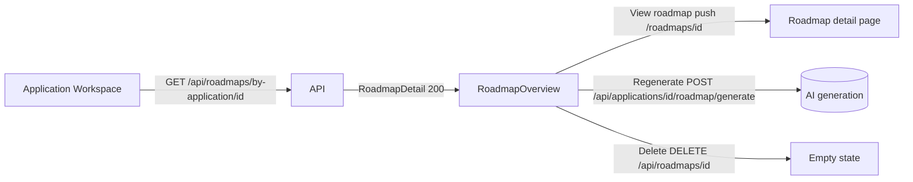

# Roadmap Overview in the Application Workspace

## Purpose

When a job application has an AI-generated (or otherwise attached) roadmap, the
Application Workspace ROADMAP section shows a **brief overview** of that roadmap —
title, goal, overall progress and a compact milestone list with per-milestone
status, priority and task-count progress. The user can open the full roadmap
detail page, regenerate or delete the roadmap without leaving the workspace.

This document is the spec for `RoadmapSection`'s ready state (the overview). See
`roadmap-generation.md` for the generate/regenerate flow and
`../applications/workspace.md` for the whole workspace page.

## Data

There is **no new endpoint**: the overview consumes the existing
`GET /api/roadmaps/by-application/{application_id}` `RoadmapDetail` payload
(`entity `entities/roadmap/types.ts` `RoadmapDetail`), which already carries:

- `title`, `goal.title`, `status`
- `progress.{completed_tasks, total_tasks, overall_percent}`
- `milestones[].{position, status, priority, tasks[]}`

Per-milestone percent is computed client-side as
`round(completed_or_skipped / total_tasks * 100)` (0 when a milestone has no
tasks), mirroring `RoadmapService.compute_progress` (prompt 144 §19).

## High-Level Layout — ROADMAP section (with roadmap)

```text
┌────────────────────────────────────────────────────────────────────────────┐
│ ROADMAP                                                                    │
│ ┌────────────────────────────────────────────────────────────────────────┐ │
│ │ Kafka → Staff Engineer Roadmap                  [ACTIVE]               │ │
│ │ Goal: Land a staff-level role                                         │ │
│ │ ▓▓▓▓▓▓▓░░░░░░░░░░░░░░░░░░ 25%                                        │ │
│ │ 1/4 tasks done                           25%                           │ │
│ │ ────────────────────────────────────────────────────────────────────   │ │
│ │ MILESTONES                                                             │ │
│ │ ① Skills foundation  [IN PROGRESS] [HIGH]        1/2  ▓▓▓▓▓▓░░░ 50%  │ │
│ │ ② Ship Kafka project  [NOT STARTED] [CRITICAL]   0/2  ░░░░░░░░░  0%  │ │
│ │ ③ Interview loop       [NOT STARTED] [MEDIUM]     0/0  ░░░░░░░░░  0%  │ │
│ │ ④ … (only first 5 milestones shown; then "+N more")                  │ │
│ └────────────────────────────────────────────────────────────────────────┘ │
│ [🔍 View roadmap] [⚡ Regenerate] [🗑 Delete]                              │
└────────────────────────────────────────────────────────────────────────────┘
```

Mermaid (workspace → detail):



## Component Hierarchy

```text
features/job-application/components/RoadmapSection.tsx
├── RoadmapReadyCard
│   └── RoadmapMilestoneOverviewRow (× first 5 milestones)
├── View roadmap / Regenerate / Delete buttons
└── ConfirmDialog (delete)
```

## States

### Empty / no roadmap

See `roadmap-generation.md`: explanatory text + `[Generate roadmap]` button.

### With roadmap (overview)

- Card header: roadmap `title`, `Goal: <goal.title>` (when present and distinct),
  `[status]` badge.
- Overall `Progress` bar + `completed/total tasks done` and overall percent.
- `MILESTONES` list: each row = index circle, `title`, status badge, priority
  badge, `done/total` and a mini progress bar.
- `+N more milestones` hint when there are more than 5.
- Actions: **View roadmap** (→ `/roadmaps/{id}`), **Regenerate** (see
  `roadmap-generation.md`), **Delete** (confirm dialog).

### Loading / error

- Query in flight / failure is handled by the React Query hooks; errors other
  than 404 render nothing in the section while the toast surface reports errors.

## Behaviors

| Element           | Behavior                                                                    |
| ----------------- | --------------------------------------------------------------------------- |
| View roadmap      | `router.push('/roadmaps/{id}')` — full detail page (edit/notes/tasks).       |
| Regenerate        | Same dispatch as generate; queued execution replaces the overview when done. |
| Delete            | Confirm dialog → `DELETE /api/roadmaps/{id}` → empty state in the section.   |
| Milestone rows    | Read-only summary; editing happens on the roadmap detail page.               |

## Responsive Behavior

- Milestone rows collapse badges onto the title line below `sm`; the per-row
  mini progress bar is hidden below `sm`.

# Related Documents

- `docs/ux/features/roadmaps/roadmap-generation.md`
- `docs/ux/features/applications/workspace.md`
- `docs/ux/features/roadmaps/roadmap-detail.md`