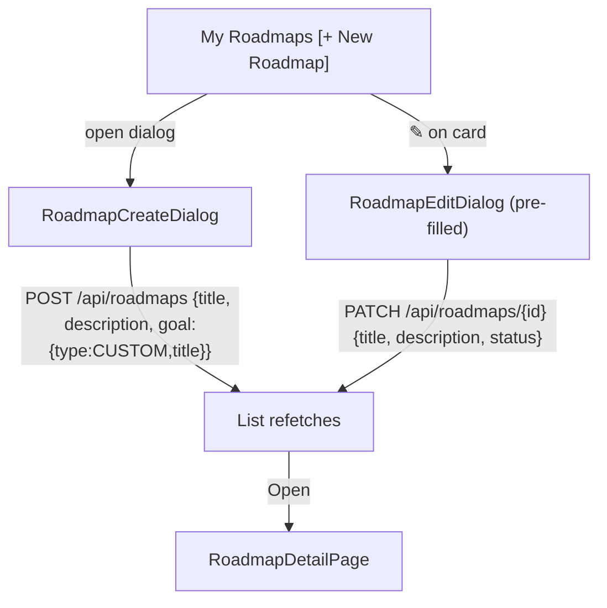

# Roadmap Create / Edit

## Purpose

Manual roadmap creation and editing via dialogs from the My Roadmaps page. A manual
roadmap has a `source=MANUAL` and a single goal. Title is required; description and
goal are optional but recommended. Roadmap status is managed in the edit dialog.

## High-Level Layout

### Create dialog (`RoadmapCreateDialog`)

```text
┌─────────────────────────────────┐
│ 🗺 New Roadmap                  │
│ Create a manual roadmap and set │
│ its goal.                       │
│                                 │
│ Title  [______________________] │
│ Description                     │
│        [______________________] │
│ Goal   [______________________] │
│                                 │
│                      [  Create ]│
└─────────────────────────────────┘
```

### Edit dialog (`RoadmapEditDialog`)

```text
┌─────────────────────────────────┐
│ ✎ Edit Roadmap                  │
│ Update roadmap details/status.  │
│                                 │
│ Title  [______________________] │
│ Description                     │
│        [______________________] │
│ Status [ ACTIVE ▾ ]             │
│                                 │
│                      [  Save  ] │
└─────────────────────────────────┘
```

Mermaid (create/edit decision tree):



## States & Behaviors

| Element | Create | Edit |
| ------- | ------ | ---- |
| Title | Required; Create disabled until non-empty | Pre-filled; Save disabled until non-empty |
| Description | Optional free textarea | Pre-filled |
| Goal | Optional input → `goal: { type: 'CUSTOM', title }` | Not shown (goal edited via detail goal block in Phase 2) |
| Status | Not shown (defaults ACTIVE) | Select: ACTIVE / COMPLETED / ARCHIVED |
| Submit | `useCreateRoadmapMutation`; toast on success/failure; dialog closes | `useUpdateRoadmapMutation`; toast; closes |

## Loading / Error / Edge Cases

- Submit buttons show pending state while the mutation runs.
- Failure → error toast; dialog stays open.
- Closed via overlay/X resets the dialog inputs on next open (fields re-seeded from
  `roadmap` when opening).

# Related Documents

- `docs/ux/features/roadmaps/my-roadmaps.md`
- `docs/ux/features/roadmaps/roadmap-detail.md`
- `docs/ux/flows/roadmaps/create-manual-roadmap.md`