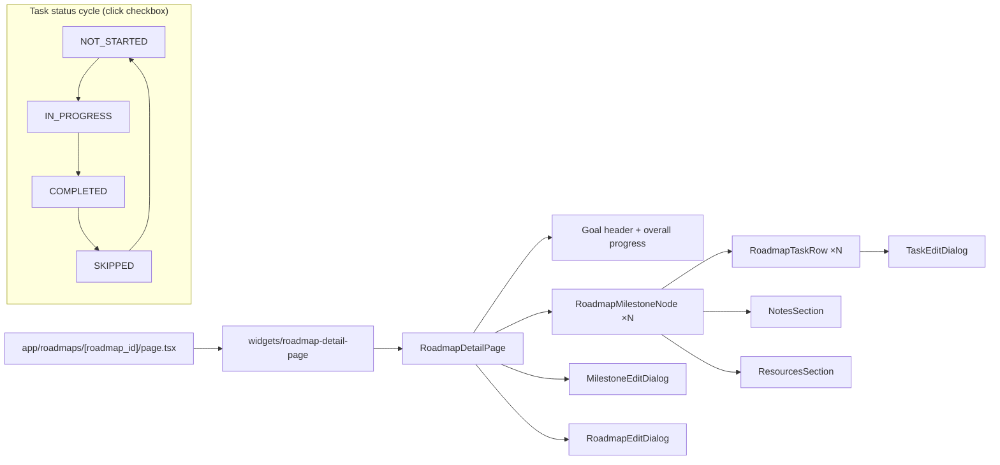

# Roadmap Detail Page

## Purpose

`/roadmaps/{roadmap_id}` is the vertical journey view of a single roadmap: the goal
header, an overall progress bar, and an ordered list of milestone nodes (each a
collapsible card with tasks, skills, notes and resources). It supports full
edit/create/delete of the roadmap and its child artifacts. Version history
(「View history」) is a Phase 2 placeholder.

## Entry Points

- "Open" on a card in `My Roadmaps`.
- "View roadmap" on the Roadmap section in the Application Workspace.
- After creating a roadmap via the create dialog the user navigates from the list.

## High-Level Layout

```text
┌──────────────────────────────────────────────────────────────────────────┐
│ ← My Roadmaps                                                            │
├──────────────────────────────────────────────────────────────────────────┤
│ 🗺 Kafka Roadmap                       [Edit] [History⛔] [Delete]        │
│ Master event streaming.                                                  │
│ [APPLICATION] [ACTIVE] [JOB]                                             │
│ ─────────────── Goal ──────────────────                                 │
│ Goal: JOB · Job                                                        │
│ Land a staff-level role                                                  │
│ ▓▓▓▓▓▓░░░░░░░░░░░░ 25%                                                 │
│ 1/4 tasks done                                                           │
├──────────────────────────────────────────────────────────────────────────┤
│ JOURNEY                                                    [+ Add Milestone]│
│ ┌────────────────────────────────────────────────────────────────────┐  │
│ │ ① Basics                              [collapsed ▾]  1/2 · 50%     │  │
│ │    [Task] [Edit] [Delete]                                          │  │
│ │ ──────────────────────────────────────────────────────────────     │  │
│ │  [IN_PROGRESS][HIGH] ⟨skills⟩  [+]                                │  │
│ │  ☐ Read docs · MEDIUM · 2h · IN PROGRESS         [🔗][✎][🗑]       │  │
│ │    Flag: know the API surface                                       │  │
│ │  NOTES (0)  [Add]                                                   │  │
│ │  RESOURCES (0)  [Add]                                               │  │
│ │  ☐ Build a demo app                        ...                      │  │
│ └────────────────────────────────────────────────────────────────────┘  │
│ ┌────────────────────────────────────────────────────────────────────┐  │
│ │ ② Apply to 3 companies                            [collapsed ▸]    │  │
│ └────────────────────────────────────────────────────────────────────┘  │
└──────────────────────────────────────────────────────────────────────────┘

Expand/collapse:
    Expanded  → task list + skills + notes + resources visible (default)
    Collapsed → summary row (number, title, done/total, progress, chevron)
```

Mermaid (component tree + task status cycle):



## Component Hierarchy

```text
features/roadmaps/components
├── RoadmapDetailPage        → detail query, goal header, journey list, dialogs
│   ├── RoadmapMilestoneNode → collapsible milestone card (+ Task/Edit/Delete actions)
│   │   ├── RoadmapTaskRow   → checkbox status cycle, title, badges, skills, edit/delete
│   │   ├── NotesSection     → milestone notes list + Add dialog
│   │   ├── ResourcesSection→ milestone resources + Add dialog + status cycle
│   │   └── SkillLinkPopover → link a skill by name to a milestone
│   ├── MilestoneEditDialog  → add / edit milestone
│   ├── TaskEditDialog       → add / edit task
│   └── RoadmapEditDialog    → edit roadmap (title, description, status)
└── (ConfirmDialog for deletes)
```

## States

### Loading
Centered "Loading roadmap..." placeholder while `useRoadmapQuery` is in flight.

### Not found / Error
"Failed to load roadmap." + Retry + Back.

### Ready

Goal header shows: title, description, source/status/goal-type badges, goal block
(type + target job/company/skill indicators + title + description), overall
`Progress` bar and task counts.

Journey list is milestone nodes sorted by `position` (0..n). Milestone node shows:
number chip, title, description, status/priority badges, skill chips, tasks, notes,
resources. If no milestones: empty state ("No milestones yet." + **Add Milestone**).

### Task rows
Each task: checkbox (cycles `NOT_STARTED → IN_PROGRESS → COMPLETED → SKIPPED` via
`PATCH /api/roadmaps/tasks/{id}`), title (strikethrough when done), description,
priority badge, estimated effort, status badge, and for present fields success
criteria + linked skill chips (each removable).

## Behaviors

| Element | Behavior |
| ------- | -------- |
| Back | `router.push('/roadmaps')`. |
| Edit (header) | `RoadmapEditDialog` → `PATCH /api/roadmaps/{id}`. |
| History | Disabled placeholder button (Phase 2 versioning). |
| Delete (header) | `ConfirmDialog` → `DELETE /api/roadmaps/{id}` then navigate to `/roadmaps`. |
| Add Milestone | `MilestoneEditDialog` (add mode) → `POST /api/roadmaps/{id}/milestones`. |
| Milestone + Task | Adds a task (`POST /api/roadmaps/milestones/{id}/tasks`). |
| Milestone Edit | `MilestoneEditDialog` (edit mode) → `PATCH /api/roadmaps/milestones/{id}`. |
| Milestone Delete | Confirm → `DELETE /api/roadmaps/milestones/{id}`. |
| Task checkbox | Cycles status as above; invalidates detail query. |
| Task Edit / Delete | `TaskEditDialog` → `PATCH/DELETE /api/roadmaps/tasks/{id}`. |
| Skill link (milestone/task) | `SkillLinkPopover` → `POST /api/roadmaps/skills { skill_name, milestone_id, task_id }`; chips removable via `DELETE /api/roadmaps/skills/{link_id}`. |
| Notes | List + Add dialog → `POST /api/roadmaps/{id}/notes { content }` (scoped milestone_id); delete per note. |
| Resources | List + Add dialog (title/url/type/description) → `POST /api/roadmaps/{id}/resources`; status cycles and delete per resource. |

## Loading / Error / Edge Cases

- Add/edit/delete failures → error toast.
- Empty task list → "No tasks in this milestone yet."
- No notes/resources → "No notes yet." / "No resources yet."
- Editing a milestone/task opens the dialog pre-filled; submit disabled until title is set.

## Responsive Behavior

- Header actions stack under the title on small screens.
- Milestone action bar (Task/Edit/Delete) stays top-right and wraps.
- Skill/priority chips wrap.

# Related Documents

- `docs/ux/features/roadmaps/my-roadmaps.md`
- `docs/ux/features/roadmaps/roadmap-create-edit.md`
- `docs/ux/features/roadmaps/roadmap-generation.md`
- `docs/ux/flows/roadmaps/create-manual-roadmap.md`
- `docs/ux/flows/roadmaps/generate-roadmap-from-application.md`