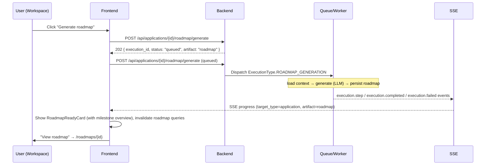

# Roadmap Generation in the Application Workspace

## Purpose

The Application Workspace (`/jobs/{job_id}/application`) replaces the legacy
"Preparation" section with a **Roadmap** section. From a job application the user can
generate an AI roadmap (goal + milestones + tasks grounded in job/company/candidate
intelligence) with live SSE progress, and then open, regenerate or delete it. The
AI-generated roadmap is persisted in the Roadmaps context and appears on `/roadmaps`.

## Entry Points

- Application Workspace → Roadmap section (see `workspace.md` — the Preparation
  section is replaced by this one).

## High-Level Layout — Roadmap Section

```text
┌────────────────────────────────────────────────────────────────────┐
│ ROADMAP                                                            │
│                                                                    │
│ No roadmap yet. Generate a step-by-step job-preparation            │
│ roadmap from the job analysis and your profile.                    │
│                                          [⚡ Generate roadmap]     │
├────────────────────────────────────────────────────────────────────┤
│ (while running — SSE GenerationProgress card above the section)    │
│ ▸ Learning roadmap · 42% · "Generate your roadmap"                 │
├────────────────────────────────────────────────────────────────────┤
│ Once generated:                                                    │
│ ┌────────────────────────────────────────────────────────────────┐ │
│ │ Kafka → Staff Engineer Roadmap          [ACTIVE]               │ │
│ │ Goal: Land a staff-level role                                  │ │
│ │ ▓▓▓▓▓▓░░░░░░ 0%                                               │ │
│ │ 0/8 tasks done                                                 │ │
│ │ MILESTONES  (brief overview — see roadmap-application-overview.md)│
│ │ ① Skills foundation [NOT STARTED][HIGH]      0/2  ░░░░░░░░    │ │
│ │ [View roadmap] [⚡ Regenerate] [🗑 Delete]                      │ │
│ └────────────────────────────────────────────────────────────────┘ │
└────────────────────────────────────────────────────────────────────┘
```

Mermaid (generate → SSE → complete → open):



## Component Hierarchy

```text
features/job-application
├── ApplicationWorkspace     → Roadmap section via RoadmapSection
└── components/
    ├── RoadmapSection       → roadmap query (by-application), states, actions
    │   ├── (empty)  Generate roadmap button + copy
    │   └── RoadmapReadyCard → title, goal, progress, View/Regenerate/Delete
    ├── GenerationProgress   → SSE progress card (artifact label "Learning roadmap")
    └── hooks/useApplicationGeneration → SSE subscription
```

## States

### No roadmap (empty)
Copy + **Generate roadmap** button. Clicking dispatches
`POST /api/applications/{id}/roadmap/generate` (`useGenerateRoadmapMutation`) → 202
`GenerateResponse(artifact="roadmap")`; toast "Roadmap generation queued". The SSE
hook (`useApplicationGeneration`) renders `GenerationProgress` while the execution
runs. On completion the `useRoadmapByApplicationQuery` is invalidated and the section
switches to the ready card.

### Ready (roadmap exists)
`RoadmapReadyCard`:

| Field | Source |
| ----- | ------ |
| Title + Goal | `roadmap.title`, `roadmap.goal.title` |
| Status badge | `roadmap.status` |
| Progress | `roadmap.progress.overall_percent` + counts |
| View roadmap | `router.push('/roadmaps/{id}')` |
| Regenerate | Re-dispatches generation (keeps existing roadmap until new one persists). |
| Delete | `ConfirmDialog` → `DELETE /api/roadmaps/{id}`; section returns to empty state. |

### Generating
While dispatch pending the Generate/Regenerate button shows a spinner and is
disabled. The top-level `GenerationProgress` card shows live workflow steps.

## Behaviors

| Element | Behavior |
| ------- | -------- |
| Generate roadmap | 202 dispatch as above; refetch roadmap on completion. |
| View roadmap | Navigate to detail page. |
| Regenerate | Same endpoint; image of a new generation overwrites on completion. |
| Delete | Confirm dialog, then remove; toast on success/failure. |

## Loading / Error / Edge Cases

- Roadmap query 404 (no roadmap) is the expected empty state.
- Dispatch failure → error toast "Failed to queue roadmap".
- Generation failure → `GenerationProgress` shows the SSE error message.

## Responsive Behavior

- Ready card collapses to a single column; action buttons wrap under the card.

# Related Documents

- `docs/ux/features/roadmaps/my-roadmaps.md`
- `docs/ux/features/roadmaps/roadmap-detail.md`
- `docs/ux/flows/roadmaps/generate-roadmap-from-application.md`
- `docs/ux/features/applications/workspace.md`
- `docs/ai/application-intelligence.md`