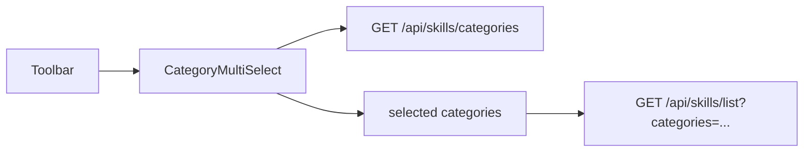

# Skills Page

## Purpose

The Skills page is the workspace for browsing and managing the skill inventory.

Users can:

- Add a new skill
- Browse all skills
- Search skills
- Filter skills by multiple categories
- Sort skills
- View skill details (level, roles, path, tags, aliases, evidence)
- Edit skill core data
- Delete a skill
- Merge duplicate skills into a canonical skill
- Multi-select skills and merge all selected into one target

The Skills page mirrors the Jobs/Companies v2 UX: virtualized table,
server-side pagination, infinite scroll, and Sheet-based drawers.

---

# Design Principles

- Skills belong to a **dynamic category catalog** seeded with the canonical
  taxonomy (`technical`, `engineering`, `professional`, `domain`, `career`);
  users can create new categories. A skill may belong to **multiple**
  categories at once.
- The Skills list is optimized for large inventories.

---

# High-Level Layout

```text
Skills Page

├── Header
├── Toolbar
├── Skills List
├── Skill Detail Drawer
├── Skill Edit Drawer
└── Add Skill Drawer
```

---

# Desktop Layout

```text
┌───────────────────────────────────────────────────────────────────────────────┐
│ ⛭ Skills (128)                    Loaded 25 of 128          ↻  + Add Skill   │
├───────────────────────────────────────────────────────────────────────────────┤
│ Search .........................            [Category ▾⌕] [Pinned] [Columns] [Clear]│
│ Select │ Pin │ Name │ Category │ Level │ Roles │ Demand │ Conf. │ Created │ Mentions │ Act.│
│───────│─────│─────────────────────────────────────────────────────────────────│
│       │ ●  │ K8s  │ engineering│ Lv.4 │ DevOps│ 90%   │ 85%   │ 2m      │ 3        │ ⋯  │
│       │ ○  │ Kafka│ technical │ Lv.2 │ Data  │ 70%   │ 60%   │ 5m      │ 1        │ ⋯  │
│       │ ○  │ DDD  │ domain    │ Lv.3 │ Backend│ —    │ 45%   │ 1h      │ 0        │ ⋯  │
│                                                                               │
│                                        Loading more skills...                 │
│                                                                               │
└───────────────────────────────────────────────────────────────────────────────┘
```

With 2+ rows selected, a bulk action bar appears in the toolbar:

```text
┌───────────────────────────────────────────────────────────────────────────────┐
│ Search .........................            [Category ▾⌕] [Pinned] [Columns] [Clear]│
│ 2 selected    [⟳ Merge 2 into...]    [Clear]                                  │
├───────────────────────────────────────────────────────────────────────────────┤
```

---

# Primary Sections

## Header

Responsibilities

- Display page title and total count.
- Display loaded-vs-total count.
- Open the Add Skill drawer.
- Refresh the current result set.

Controls

| Control    | Description                                                   |
| ---------- | ------------------------------------------------------------- |
| Add Skill  | Opens the Add Skill drawer.                                   |
| Refresh    | Reloads the current query (spins while a refetch is in flight). |

---

## Toolbar

Responsibilities

- Search skills.
- Filter skills by multiple categories (OR semantics).
- Filter skills by pinned state.
- Toggle the Pin column.
- Clear active filters.

Controls

| Control  | Description                                     |
| -------- | ----------------------------------------------- |
| Search   | Search by name, role, path, or alias.           |
| Category | Multi-select category filter (searchable dropdown; OR across selected categories). |
| Pinned   | Toggle pinned-only view.                        |
| Columns  | Show / hide the Select and Pin columns.         |
| Clear    | Clears all active filters.                      |

Search is debounced (300ms) via the shared `DebouncedInput` primitive.

### Category filter dropdown

The category filter is a **multi-select dropdown** (checkbox popover) populated
from `GET /api/skills/categories` — the live catalog, not a hardcoded list.

```text
┌──────────────────────────────┐
│ CATEGORIES (2)         Clear │
├──────────────────────────────┤
│ ⌕ Search categories...    ⨯  │
├──────────────────────────────┤
│ ☑ technical                  │
│ ☐ engineering                │
│ ☐ professional               │
│ ☐ domain                     │
│ ☐ career                     │
└──────────────────────────────┘
```

- Selecting a category **adds** it to the filter; clicking again **removes** it.
- The list filter uses **OR** semantics: a skill matches when it belongs to any
  selected category.
- The dropdown has its own **search box** to filter the catalog by name.
- The trigger shows the selected values as **category badges** (up to 3) plus a
  `+N` overflow indicator.
- Unlike the Edit/Add drawers, the list filter does **not** offer inline
  "add category" — the filter only browses existing categories.
- Each active category contributes to `activeFilterCount`; the toolbar **Clear**
  action resets the whole selection.



---

## Bulk Action Bar

When at least one skill is selected, the toolbar grows a second row:

| Control            | Description                                          |
| ------------------ | ---------------------------------------------------- |
| `N selected`       | Live count of selected rows (across loaded pages).   |
| Merge N into...    | Opens the Merge Skill dialog to pick a target.       |
| Clear              | Deselects all rows.                                  |

The bar is only rendered while `selectedCount > 0`.

---

# Skills List

The Skills List is implemented as a virtualized row-based table (mirrors the
Jobs/Companies v2 `JobsTable` / `CompaniesTable`).

The frontend **does not use page numbers**.

Instead it uses **Infinite Loading** via cursor-based pagination.

The backend exposes a cursor-paginated API (`GET /api/skills/list`).

The Skills List preserves:

- Search
- Category filter
- Sorting
- Scroll position

when opening Skill Details.

---

# Infinite Loading

Loading sequence

```text
Open Skills

↓

Load first page (page_size=25)

↓

Render rows

↓

User scrolls

↓

Reach loading threshold (sentinel, 200px margin)

↓

Request next page with cursor

↓

Append rows

↓

Repeat until has_more = false
```

Configuration

| Property          | Value            |
| ----------------- | ---------------- |
| Initial page size | 25               |
| Next page size    | 25               |
| Pagination        | Backend only     |
| Frontend UX       | Infinite Loading |

---

# Row Columns

| Column     | Description                                        |
| ---------- | -------------------------------------------------- |
| Select     | Checkbox toggling row selection (multi-select)     |
| Pin        | Pushpin toggle for pinned skills                   |
| Name       | Skill name + origin badge (AI/Manual) + alias count badge |
| Category   | All category badges for the skill (one per category) |
| Level      | Skill proficiency level (Lv.1 … Lv.10)             |
| Roles      | Relevant roles                                     |
| Demand     | Market demand percentage                           |
| Confidence | AI confidence percentage                           |
| Created    | Relative creation time                             |
| Mentions   | Total job/company mentions referencing this skill (sortable) |
| Actions    | Row actions (Details, Edit, Delete)                |

The Select and Pin columns are hidden by default; both can be toggled via the
toolbar Columns dropdown.

---

# Multi-Select

The Select column supports batch operations. Selection follows best practices
for a virtualized, infinitely-loaded list:

- **Selection lives in the page state** (`Set<skillId>`), not in rows — rows are
  unmounted when scrolled out of view, so selection survives scrolling and
  pagination.
- **Select-all** (header checkbox) toggles every *loaded* row; the header shows
  an indeterminate state when only some loaded rows are selected.
- **Selection is cleared** when the search query or any filter changes (the
  visible set changes).
- **Selection is pruned** to the loaded rows after a refetch, so ids of deleted
  or merged skills are dropped automatically.
- Checkbox clicks stop propagation and never open the detail drawer.

The only bulk action today is **Merge N into...**. See
`docs/ux/flows/skills/merge-skills.md` for the full flow.

---

# Column Details

## Pin

A leading pushpin button toggling the skill's pinned flag.

- Empty pin: not pinned.
- Filled (primary color) pin: pinned.

The toggle is optimistic — the pin updates immediately and is rolled back on
failure. The button is a separate interactive element and does not trigger row
selection.

## Name

Displays the skill name and, when aliases exist, an alias count badge. An origin
badge indicates where the skill came from:

| Badge   | `source_type`      | Meaning             |
| ------- | ------------------ | ------------------- |
| AI      | `ai_generated`     | Created by processing (job/company analysis) |
| Manual  | `user_input`       | Created by the user |

```text
Kubernetes  [AI]  2 aliases
```

---

## Category

Displays **every** category the skill belongs to, one badge per category. The
first category (when the catalog link table is empty) falls back to the legacy
primary `category` column. Badge colors are deterministic: the canonical five
categories keep fixed colors, and any user-created category gets a stable
hash-based color from a fixed palette:

| Category     | Color   |
| ------------ | ------- |
| technical    | Blue    |
| engineering  | Green   |
| professional | Purple  |
| domain       | Orange  |
| career       | Cyan    |
| user-defined | Stable hash → rose/amber/emerald/teal/sky/indigo/fuchsia/lime |

```text
Kubernetes  [technical] [engineering]
```

The column is widened (≥150px) so multiple badges fit on one row.

---

## Level

Displays the proficiency level.

```text
Lv.4
```

---

## Demand

Displays `market_relevance` as a percentage. Color thresholds:

| Value | Color   |
| ----- | ------- |
| ≥ 80  | Green   |
| ≥ 50  | Yellow  |
| < 50  | Orange  |
| null  | —       |

---

## Confidence

Displays the AI confidence as a percentage using the same thresholds.

---

## Mentions

Displays the total number of job/company analysis mentions that reference this
skill: the sum of the skill's own mentions plus the mentions recorded under any
separate skill row whose name matches one of the skill's aliases (e.g. an
ai_generated "K8s" row folds into "Kubernetes" once "K8s" is registered as an
alias). A nonzero count is highlighted; zero renders muted. The column is
sortable (see Sorting below).

---

# Row Actions

Each row provides three icon actions (tooltip buttons):

| Action  | Description                        |
| ------- | ---------------------------------- |
| Details | Opens Skill Details drawer.        |
| Edit    | Opens Skill Edit drawer.           |
| Delete  | Deletes the skill (with confirm).  |

All row actions stop propagation so clicking an action never opens the detail
drawer.

---

# Skill Detail Drawer

Selecting a row opens the Skill Detail drawer (Sheet from the right) showing the
skill's data directly (no tabs):

- **Categories** — a dedicated section right below the stats row showing one
  badge per category (a skill can belong to multiple categories), then
- Level, confidence, market demand, roles, path, tags, aliases, and "Why This
  Skill Matters" (evidence).

The header has an **Edit** button; the footer has a **Delete** button. Category
badges live in the dedicated body section, not the header — see
`docs/ux/features/skills/skill-detail.md`.

---

# Skill Edit Drawer

The Edit drawer (Sheet) edits:

- Name (required)
- Level (1–10 select)
- Categories (multi-select with inline **+ add** — see below)
- Relevant Roles
- Tags (comma-separated)
- **Aliases** — add/remove alternate names via `POST`/`DELETE
  /api/skills/{id}/aliases`
- **Merge** — "Merge into another skill" opens the Merge Skill dialog
  (`POST /api/skills/merge`)

Saving calls `PUT /api/skills/{id}` and invalidates the list query. The payload
sends `categories: string[]`; the backend replaces the link set and keeps the
legacy primary `category` column in sync (first category).

### Category multi-select (Edit / Add)

The Edit and Add drawers use the same `CategoryMultiSelect` dropdown as the
filter, with two differences:

- The list is populated from the live catalog (`GET /api/skills/categories`).
- An inline **"+ add"** field creates a new category via
  `POST /api/skills/categories` and auto-selects it, so a skill can be tagged
  with a brand-new category in one step.

```text
┌──────────────────────────────┐
│ CATEGORIES (1)         Clear │
├──────────────────────────────┤
│ ☑ technical                  │
│ ☐ engineering                │
│ ...                          │
├──────────────────────────────┤
│ [Add category...] [+]        │
└──────────────────────────────┘
```

Submitting a brand-new category name creates the catalog row (idempotent),
selects it, and keeps the skill's category set.

---

# Merge Skill Dialog

The Merge dialog searches visible skills (excluding the source skill(s)), lets
the user pick a target, and merges the source(s) into it. Mentions re-point to
the target; the source skill(s) become hidden aliases.

- **Single merge** — opened from the Edit drawer with one source.
- **Bulk merge** — opened from the bulk action bar with all selected sources
  (`POST /api/skills/merge` with `source_ids` = the selected ids).

The dialog mirrors the Companies "Relate Company" UX. When multiple sources are
involved, the description lists them and the footer button reads
"Merge N into selected".

---

# Add Skill Drawer

The Add Skill drawer (Sheet) collects:

- Name (required)
- Level (1–10 select)
- Categories (multi-select with inline **+ add**, shared control)
- Relevant Roles
- Path

Submitting calls `POST /api/skills` with
`{name, level, roles, path, category, categories}`. The primary `category` is
derived from the first selected category for legacy consumers. After a
successful submit the drawer closes and the skill appears in the list.

---

# Pinned Filter

A pushpin toggle in the toolbar restricts the list to pinned skills.

```text
○ All Skills
pinned Pinned only
```

When active it counts as an active filter and is cleared by the toolbar's Clear
action alongside the others. Pinning or unpinning a skill while the filter is
active refetches the list so rows update immediately.

---

# Sorting

Supported sort fields (backend, NULLS LAST):

- `mention_count` (default, desc — highest-demand skills first)
- `created_at`
- `name`
- `level`
- `confidence`
- `market_relevance`

Sorting is always performed by the backend. Rows where the sort column is empty
sort last in both directions.

---

# Data Refresh

The Refresh button in the Header reloads the current query. It calls the same
`refetch` used by the error-state Retry button, so it works from any state
(including the error state, where the header remains available). While a
refetch is in flight the button is disabled and its icon spins.

# Empty States

## No Skills

```text
No skills yet. Add one or run an AI analysis.
```

---

# Loading States

## Initial Loading

- Skeleton rows

## Infinite Loading

```text
Loading more skills...
```

Existing rows remain interactive.

---

# Error States

## Backend Error

```text
Unable to load skills.

Retry
```

---

# Performance Requirements

The page must support

- Large skill inventories
- Virtual scrolling
- Infinite loading
- Stable scroll position

The frontend never renders all rows simultaneously; only visible rows are
mounted.

---

# Related Documents

- `docs/api/skills/list-skills.md`
- `docs/ux/features/skills/skill-row.md`
- `docs/ux/features/skills/skill-detail.md`
- `docs/ux/features/skills/add-skill.md`
- `docs/ux/features/skills/edit-skill.md`
- `docs/ux/flows/skills/browse-skills.md`
- `docs/ux/features/companies/page.md` (reference: shared virtualized-table UX)
