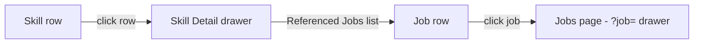

# Skill Detail Drawer

## Purpose

The Skill Detail drawer shows everything the AI knows about a skill.

---

# Anatomy

```text
┌────────────────────────────────────────────────────────────┐
│ </> Kubernetes [AI]   Edit                                ✕ │
├────────────────────────────────────────────────────────────┤
│ ★ Lv.4   Confidence: 85%   Market: 90%                    │
│                                                            │
│ ┌─ Categories ──────────────────────────────────────────┐  │
│ │ [engineering] [infrastructure]                        │  │
│ └────────────────────────────────────────────────────────┘  │
│ ┌─ Relevant Roles ──────────────────────────────────────┐  │
│ │ DevOps, SRE, Platform                                  │  │
│ └────────────────────────────────────────────────────────┘  │
│ ┌─ Path ─────────────────────────────────────────────────┐  │
│ │ ./kubernetes/platform                                  │  │
│ └────────────────────────────────────────────────────────┘  │
│ ┌─ Tags ─────────────────────────────────────────────────┐  │
│ │ [infra] [orchestration]                                │  │
│ └────────────────────────────────────────────────────────┘  │
│ ┌─ Also Known As ────────────────────────────────────────┐  │
│ │ [K8s] [Kube]                                           │  │
│ └────────────────────────────────────────────────────────┘  │
│ ┌─ Why This Skill Matters ───────────────────────────────┐  │
│ │ Critical for cloud-native platform engineering.         │  │
│ └────────────────────────────────────────────────────────┘  │
│ ┌─ Referenced Jobs (2) ──────────────────────────────────┐  │
│ │ · SRE Engineer        Berlin          [B]             │  │
│ │   Fit 8  Success 7  Overall 9                          │  │
│ │ · Platform Engineer   Munich          [A]             │  │
│ │   Fit 6  Success 8  Overall 7                          │  │
│ └────────────────────────────────────────────────────────┘  │
├────────────────────────────────────────────────────────────┤
│          [✂ Break down]                    [🗑 Delete]     │
└────────────────────────────────────────────────────────────┘
```



---

# Header

| Element      | Behavior                                         |
| ------------ | ------------------------------------------------ |
| Title        | Skill name + OriginBadge.                        |
| Edit button  | Switches to the Edit drawer (`onEdit`).          |
| Close        | Closes the drawer, clears `?skill=` param.       |

Category badges are not shown in the header — they live in the dedicated
**Categories** section of the body, because a skill can belong to multiple
categories.

---

# Content

| Section           | Source field        |
| ----------------- | ------------------- |
| Level             | `level` (Lv.{n})    |
| Confidence        | `confidence` (%)    |
| Market demand     | `market_relevance`  |
| Categories        | `categories` (all badges; falls back to `category`) |
| Relevant Roles    | `roles`             |
| Path              | `path`              |
| Tags              | `tags` (badges)     |
| Also Known As     | `aliases` (badges)  |
| Why This Matters  | `evidence`          |
| Referenced Jobs   | `GET /skills/{id}/jobs` (jobs-only mentions) |

The **Categories** section is rendered right below the stats row, above Relevant
Roles. It shows one badge per category (deterministic colors — see
`page.md` → Category). The section is hidden entirely when a skill has no
categories at all.

The **Referenced Jobs** section is the last section in the drawer and lists the
jobs that mention the skill (`source_type="job"`). The header count equals the
number of listed jobs (jobs-only — it can be lower than the row-level
`mention_count`, which also counts company mentions). States:

| State   | Rendering                                              |
| ------- | ------------------------------------------------------ |
| Loading | "Loading jobs…"                                         |
| Error   | "Unable to load jobs" (destructive text)               |
| Empty   | "No jobs reference this skill yet."                     |
| List    | One row per job: title, location, Fit/Success/Overall badges + grade badge. Clicking a row navigates to the Jobs page with that job's drawer open (`/jobs?job=<id>`). |

Sections with no data are omitted (no empty boxes).

---

# Footer

| Action     | Behavior                                         |
| ---------- | ------------------------------------------------ |
| Break down | Opens the Break down dialog for this skill.      |
| Delete     | Opens the ConfirmDialog; deletes the skill,      |
|            | closes drawer, clears `?skill=`.                 |

---

# Behaviors

- The `?skill=<id>` URL parameter deep-links the drawer (survives reload).
- Edit swaps the drawer while keeping the same skill selected.
- Clicking a referenced job navigates to the Jobs page and opens that job's
  drawer (`/jobs?job=<id>`), mirroring the companies drawer behavior.

---

# Related Documents

- `docs/ux/features/skills/page.md`
- `docs/ux/features/skills/edit-skill.md`
- `docs/ux/features/skills/skill-row.md`
