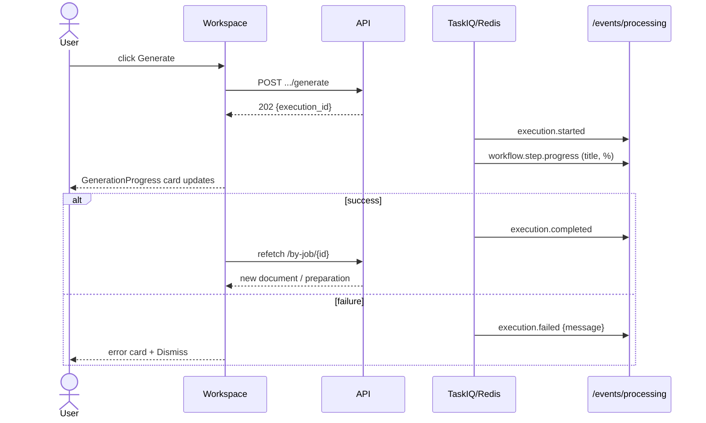

# Generate Application Artifacts Flow

## Purpose

This flow defines how the user generates the three application artifacts —
**preparation plan**, **tailored resume**, and **cover letter** — from the Job
Application Workspace, and watches the generation live.

Artifacts are produced **asynchronously** through the existing processing pipeline
(TaskIQ + LangGraph) with SSE progress. Each artifact maps to one execution type:

| Artifact | Endpoint | ExecutionType |
| -------- | -------- | ------------- |
| Preparation plan | `POST /api/applications/{id}/preparation/generate` | `application_preparation` |
| Tailored resume | `POST /api/applications/{id}/documents/tailored_resume/generate` | `application_resume` |
| Cover letter | `POST /api/applications/{id}/documents/cover_letter/generate` | `application_cover_letter` |

## Overview

```text
[⚡ Generate / Regenerate]
        │
        ▼
POST /api/applications/{id}/.../generate   →  202 {execution_id}
        │
        ▼
execution queued → TaskIQ worker runs LangGraph workflow
        │
        ▼
SSE /events/processing  (target_type="application")
        │  execution.started · workflow.step.* · execution.completed|failed
        ▼
GenerationProgress card updates live (step title + %)
        │
        ▼
completed/failed  →  application query refetched → new artifact visible
```

## Flow Steps

1. **Trigger**: click `[⚡ Generate]` (no artifact yet) or `[⚡ Regenerate]` (artifact
   exists) on the preparation section or a document card.
2. **Dispatch**: the API creates a `ProcessingExecution` (target `application`) and
   dispatches it to the queue; returns `202 {execution_id, status: "queued"}`. A toast
   confirms the queueing.
3. **Watch live**: the page-level `GenerationProgress` card appears, driven by SSE
   events for `target_type="application"` and `target_id={application.id}`:
   - `execution.started` → card shows running.
   - `workflow.step.progress` → card shows the current step title and percent.
   - `execution.completed` → card shows success + Dismiss.
   - `execution.failed` → card shows the error message.
4. **Refresh**: on completion/failure the application query is invalidated/refetched so
   the new document/preparation (or the missing artifact) renders.

## Workflow

The generation workflow is a consumer of existing intelligence: it assembles the job
context, job skills, company context and candidate profile (already persisted by the
pipeline) and produces only the artifact.

```mermaid
flowchart LR
    subgraph Backend
        A[POST .../generate] --> B[CreateProcessingExecutionUseCase]
        B --> C[Dispatch to TaskIQ]
        C --> D[ApplicationIntelligenceGraph]
        D --> D1[load_context]
        D1 --> D2[generate]
        D2 --> D3[persist]
        D3 --> D4[ready | failed]
    end
    subgraph Frontend
        F[Generate button] --> G[SSE GenerationProgress card]
        G -->|completed/failed| H[refetch application]
    end
    D4 -. processing events .-> G
```

## Sequence



## Edge Cases

- **Concurrent generation**: the pipeline forbids a second active execution for the same
  application (409). The UI disables the affected Generate button while one is running.
- **Generation failed**: the card shows the failure message; the artifact stays at its
  previous version (or absent). The user can retry via Generate/Regenerate.
- **Regenerate**: queues a new version; the old document/plan remains visible until the
  new one persists.

# Related Documents

- `docs/ux/features/applications/workspace.md`
- `docs/ux/features/applications/preparation-plan.md`
- `docs/ux/features/applications/application-documents.md`
- `docs/ux/flows/applications/prepare-and-apply.md`
