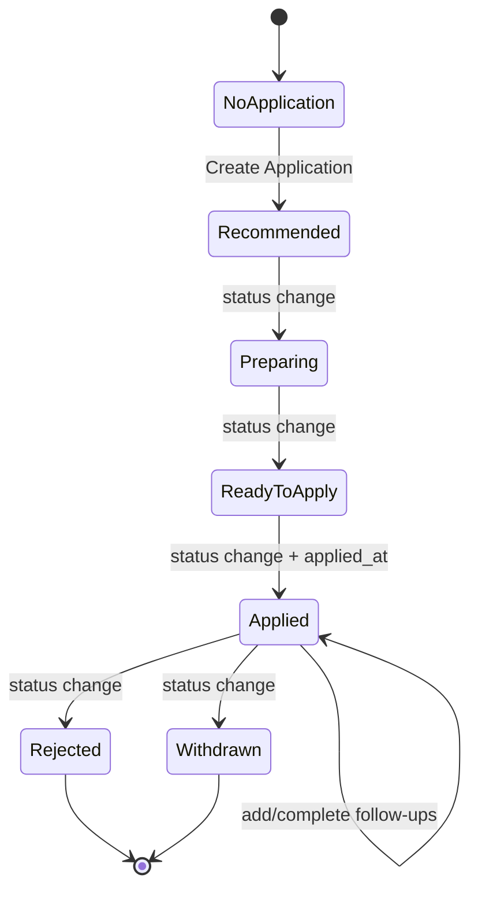
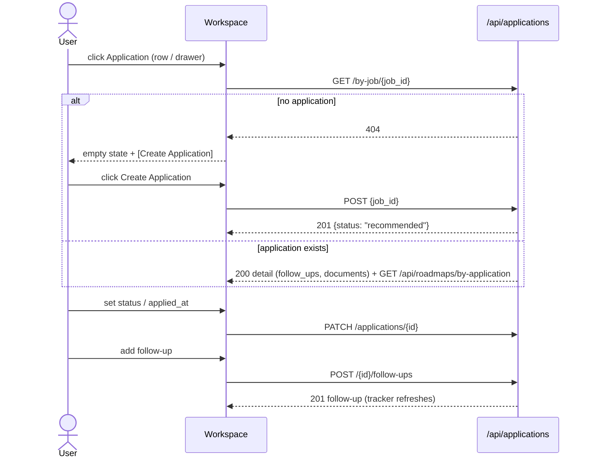

# Prepare and Apply Flow

## Purpose

This flow defines the user journey from a Job to an **application** in the Job
Application Workspace (`/jobs/{job_id}/application`): creating the application record,
tracking its status and follow-ups, and applying.

It does not define the AI generation journey (see
`generate-application-artifacts.md`).

## Actors and Entry Points

A user can enter the workspace from either:

- A **job row action** (airplane icon, tooltip "Application") on the Jobs page, or
- The **Application** button in the **Job Detail drawer** header.

## Overview

```text
Job row / Job detail drawer
        │  click Application
        ▼
Workspace at /jobs/{id}/application
        │
        ├── no application?  ──▶  [Create Application] ──▶ status "recommended"
        │
        ▼
  APPLICATION  tracker section
        │  set status, applied date
        ▼
  PREPARATION / DOCUMENTS      (see generate-application-artifacts.md)
        │
        ▼
  status → "applied" (+ applied_at)  ← follow-ups scheduled
```

## Flow Steps

1. **Enter the workspace** from a job row action or the drawer button.
2. **Create the application** (if none exists): the workspace shows the empty state with
   `[Create Application]`. `POST /api/applications {job_id}` creates the record with
   status `recommended` (201) and the three sections appear.
3. **Track the pipeline**: the tracker section shows status and applied date.
   - The user moves status through `recommended → preparing → ready_to_apply → applied`
     (or `rejected` / `withdrawn`).
   - Optionally sets **Applied at**.
4. **Schedule follow-ups**: add a note + optional date; toggle ☐/☑ as actions happen.
5. **Generate the roadmap and documents** (see the generation flow), then mark the
   application **Applied** with the date.

## State Diagram



## Sequence



## Edge Cases

- **Application already created** (repeat entry from another browser): creating again
  surfaces a conflict — the UI shows an error toast.
- **Job deleted**: `GET /by-job` returns 404 and the workspace shows "Unable to load the
  job."; the "Back to Job" link still works.
- **Follow-up with no note and no date**: the Add button is disabled.

# Related Documents

- `docs/ux/features/applications/workspace.md`
- `docs/ux/features/applications/application-tracker.md`
- `docs/ux/flows/applications/generate-application-artifacts.md`
