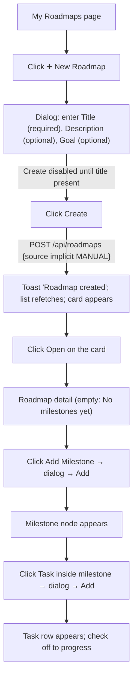

# Flow: Create a Manual Roadmap

## Goal

Create a new learning/job-preparation roadmap from scratch (no AI), set its goal,
and start adding milestones and tasks on the detail page.

## Actors & Entry

- **Actor**: signed-in user.
- **Entry**: `/roadmaps` →

## Steps



## Wireframe of key screens

```text
/roadmaps (list):
  [My Roadmaps]                  [ ➕ New Roadmap]
  ┌───────────────────────────┐
  │ 🗺 My New Roadmap          │
  │ Goal: CUSTOM              │
  │ [MANUAL][ACTIVE] 0/0 · 0% │
  │ [Open] [✎] [🗑]           │
  └───────────────────────────┘

/roadmaps/{id} (after add milestone/task):
  [← My Roadmaps]
  🗺 My New Roadmap
  JOURNEY                                [+ Add Milestone]
  ┌ ① Foundation ──────────┐
  │ ☐ First task · MEDIUM   │
  └─────────────────────────┘
```

## Edge Cases

| Case | Behavior |
| ---- | -------- |
| Title empty | Create button stays disabled |
| Create fails | Error toast; dialog remains open |
| Duplicate titles | Allowed (no uniqueness) |
| Long text | Inputs wrap; card title truncates |
| Cancel | Dialog closes without creating |

# Related Documents

- `docs/ux/features/roadmaps/roadmap-create-edit.md`
- `docs/ux/features/roadmaps/my-roadmaps.md`
- `docs/ux/features/roadmaps/roadmap-detail.md`