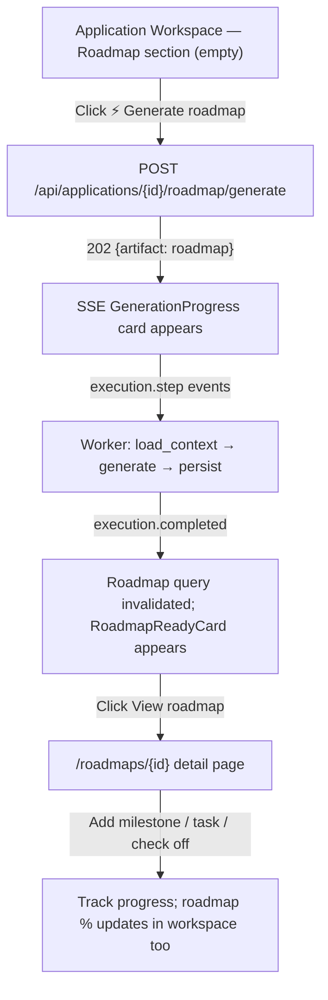
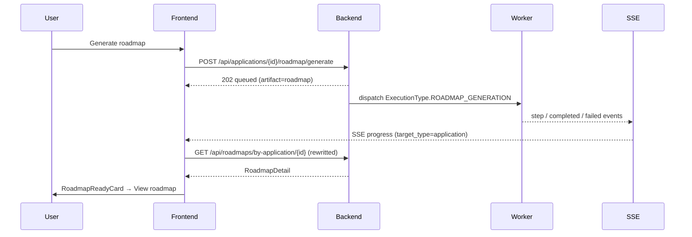

# Flow: Generate a Roadmap from an Application

## Goal

From a job application in the Application Workspace, generate an AI roadmap
(goal + milestones + tasks) grounded in the job/company/candidate intelligence,
watch it generate live, then open and work through it.

## Actors & Entry

- **Actor**: signed-in user on `/jobs/{job_id}/application`.

## Steps



## Sequence (generate → SSE → complete → open)



## States in the Workspace section

```text
1. EMPTY        No roadmap yet + [Generate roadmap]
2. GENERATING   GenerationProgress card (spinner step) — button disabled
3. DONE         RoadmapReadyCard (title/goal/progress + View/Regenerate/Delete)
4. FAILED       GenerationProgress shows execute error; Retry re-dispatches
5. DELETED      back to EMPTY
```

## Edge Cases

| Case | Behavior |
| ---- | -------- |
| Application has no roadmap yet | Empty state; Generate enabled |
| Generation already running | Generate/Regenerate disabled until settled |
| Dispatch returns 404 (bad app id) | Error toast; button re-enabled |
| Execution fails | SSE error surfaced in the progress card; Retry |
| Regenerate while a roadmap exists | New run queued; old roadmap shown until new persists |
| Roadmap deleted from detail | Workspace section returns to empty state |

# Related Documents

- `docs/ux/features/roadmaps/roadmap-generation.md`
- `docs/ux/features/roadmaps/roadmap-detail.md`
- `docs/ux/features/applications/workspace.md`
- `docs/ai/application-intelligence.md`
- `docs/domain/overview.md` (roadmaps context)