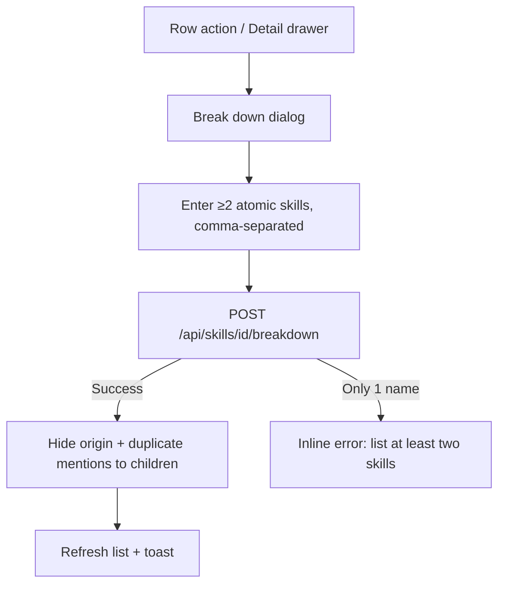

# Break Down a Composite Skill

## Purpose

How a user splits a composite skill (e.g. "Data Engineering", "SQL / NoSQL")
into its atomic children. The children become separate skills, the origin's
job/company mentions are duplicated onto every child, and the origin is
soft-hidden. Extraction then surfaces the children whenever a job requires the
composite.

---

# Flow

```text
Skill row → "Break down" action (Scissors)   OR   Skill Detail drawer → "Break down"
        │
        ▼
Break down dialog (comma-separated atomic skills input)
        │
        ▼
Type ≥2 distinct child names
        │
        ▼
Confirm → POST /api/skills/{id}/breakdown {child_names: [...]}
        │
        ├── Success → dialog closes, origin hidden, list refreshes,
        │             toast "Broke <name> down into N skills"
        └── Error   → inline validation message (need ≥2 names) or toast
```



---

# Steps

## 1. Open the dialog

From the row actions, click **Break down** (Scissors), or from the Skill Detail
drawer footer click **Break down**. The dialog opens pre-filled empty.

## 2. Enter children

Type the atomic skills separated by commas (e.g. `Spark, Airflow`). The submit
button requires at least two distinct names; a single name shows an inline
error and the button stays enabled but validation blocks submission.

## 3. Confirm

Click **Break down**. The backend:

- Resolves each child by exact name, alias, or canonical slug (creating a new
  skill only when nothing matches).
- Records `origin → child` links in `skill.skill_breakdowns` (idempotent).
- Duplicates the origin's `skill_mentions` rows onto every child (deduped by
  `(source_type, source_id)`).
- Soft-hides the origin (`hidden = 1`).

The list query is invalidated; any open Detail/Edit drawer for the origin
closes; a toast confirms.

---

# Edge Cases

## Fewer than two children

The dialog blocks submission with fewer than two distinct names; the backend
returns `422` (schema `min_length=2`) or `400` for duplicate/self names.

## Child already exists

Children are resolved by slug — a case/format variant of an existing skill
(e.g. `nosql` for `NoSQL`) reuses that skill instead of creating a duplicate.

## Origin already hidden

A breakdown of a hidden skill is rejected with `400`.

## Missing origin

`404` is returned when the skill does not exist.

## Redundant breakdown

Running the same breakdown again is idempotent: existing `origin → child`
links are kept, mentions are deduped, no new children are created.

---

# Related Documents

- `docs/ux/features/skills/skill-row.md`
- `docs/ux/features/skills/skill-detail.md`
- `docs/ux/features/skills/edit-skill.md`
