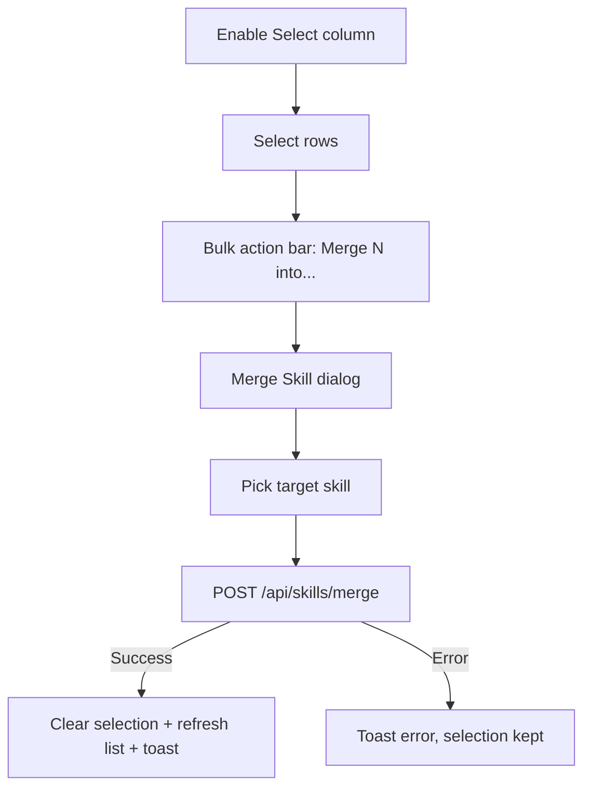

# Merge Skills

## Purpose

How a user consolidates duplicate skill rows into a single canonical skill.

The user picks a target skill; the source skill(s) mentions re-point to the
target, and the source(s) become hidden aliases of it. Merging works for a
single skill (from the Edit drawer) or for many selected skills at once (from
the list multi-select).

---

# Flow

## Single merge

```text
Skill row → Edit drawer → "Merge into another skill"
        │
        ▼
Merge Skill dialog (search skills, exclude current)
        │
        ▼
Pick a target skill
        │
        ▼
Confirm → POST /api/skills/merge {target_id, source_ids: [current]}
        │
        ├── Success → drawer closes, list refreshes
        └── Error   → inline error, dialog stays open
```

## Bulk merge

```text
Enable Select column (Columns dropdown)
        │
        ▼
Select rows (header checkbox selects all loaded; selection survives pagination)
        │
        ▼
Bulk action bar appears in the toolbar → "Merge N into..."
        │
        ▼
Merge Skill dialog (excludes all selected; description lists them)
        │
        ▼
Pick a target skill
        │
        ▼
Confirm → POST /api/skills/merge {target_id, source_ids: [all selected]}
        │
        ├── Success → selection clears, list refreshes, toast "Merged N skills"
        └── Error   → toast error, dialog closes, selection kept
```



---

# Steps

## 1. Open the merge dialog

From the Skill Edit drawer, click **Merge into another skill**. The Merge Skill
dialog opens with a debounced search over visible skills (page_size=20, sorted
by name asc). The current skill is excluded from the candidate list.

## 2. Pick a target

Candidates show their name and, when present, their mention count. Clicking a
row selects it.

## 3. Merge

Click **Merge into selected**. The backend:

- Re-points `skill_mentions` rows from the source to the target (skipping
  duplicate `(source_type, source_id)` keys already on the target).
- Adds the source name as an alias of the target.
- Hides the source skill.

The list query is invalidated; the edit drawer closes.

## 4. Bulk merge (multi-select)

From the Skills list:

1. Enable the **Select** column via the toolbar **Columns** dropdown.
2. Tick rows (the header checkbox selects all *loaded* rows; an indeterminate
   state shows partial selection). Selection survives scrolling and pagination.
3. The toolbar renders a bulk bar: **N selected**, **Merge N into...**, **Clear**.
4. **Merge N into...** opens the Merge Skill dialog. All selected skills are
   excluded from the candidate list and listed in the description; the footer
   button reads **Merge N into selected**.
5. Pick a target and confirm. The same `POST /api/skills/merge` is called with
   `source_ids` = every selected skill id (the endpoint already loops over the
   list).
6. On success the selection clears, the list refetches, and a toast confirms.
7. **Clear** (or changing the search/filters) clears the selection.

The backend rejects an empty `source_ids` array and a target that is also one of
the sources with `400`.

---

# Edge Cases

## No candidates

Empty result shows "No skills found." — the merge button stays disabled until a
target is selected.

## Merging a skill with no mentions

The target simply gains the alias and the source is hidden; nothing else changes.

## Empty bulk selection

The bulk bar only renders when ≥1 row is selected; the merge button is never
reachable with no sources. The backend additionally rejects an empty
`source_ids` array with `400`.

## Target selected as a source

All selected sources are excluded from the candidate list, so the target can
never be one of its own sources. The backend also returns `400` if a caller
passes the target inside `source_ids`.

## Duplicate mention keys

When the source and target already share a mention (same job/company), the
source's duplicate row is dropped and the target's existing mention is kept.

## Mention counting without merging

Adding an alias alone does not re-point `skill_mentions` rows. Instead,
`mention_count` folds aliases at read time: a skill's count is the sum of its
own mentions plus the mentions stored under any separate skill row whose name
matches one of its aliases. Merge is only needed when you want the source row
removed/hidden (physically folded).

## Alias mentions fold at read time

A skill's `mention_count` always includes the mentions recorded under any
separate skill row whose name matches one of its aliases. This folding happens
at read time in the list endpoint, independent of merging — so simply adding an
alias (e.g. "K8s" on "Kubernetes") makes that alias skill row's stored mentions
count toward the canonical skill without any data movement. Merge remains the
explicit way to physically re-point and hide a duplicate row.

---

# Related Documents

- `docs/ux/features/skills/edit-skill.md`
- `docs/ux/features/skills/page.md`
- `docs/ux/features/companies/relate-company.md` (reference: picker dialog UX)
